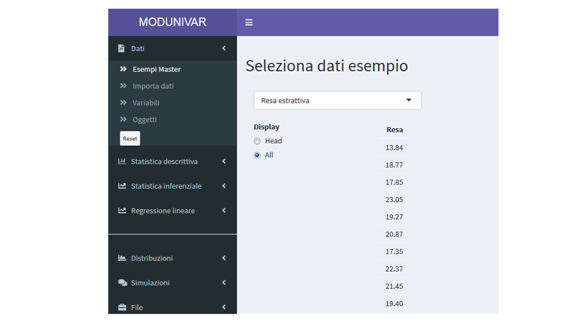
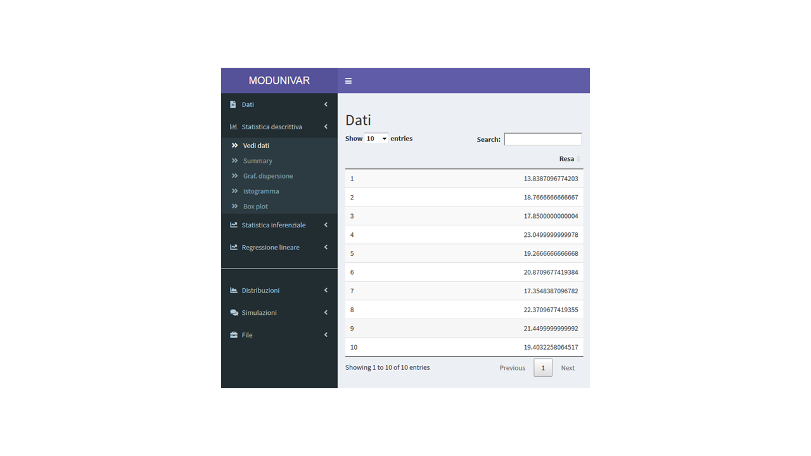
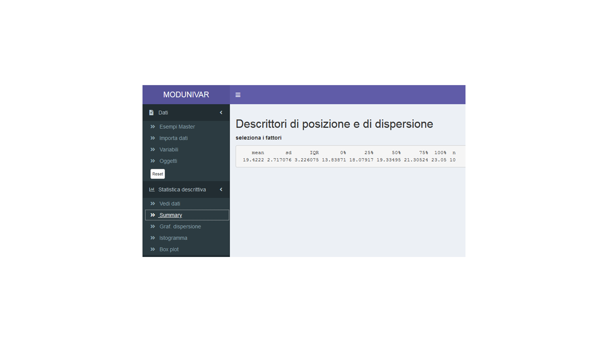
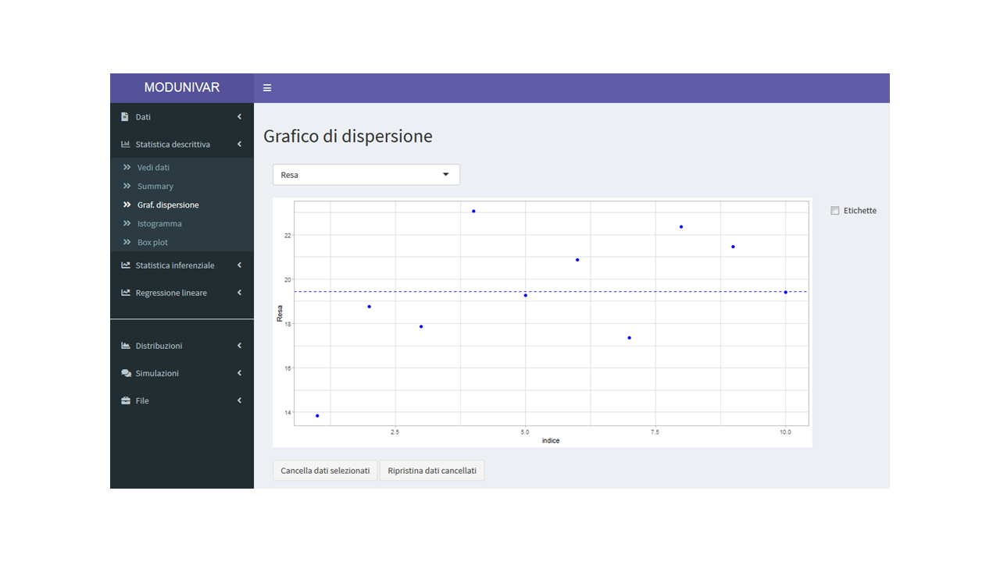
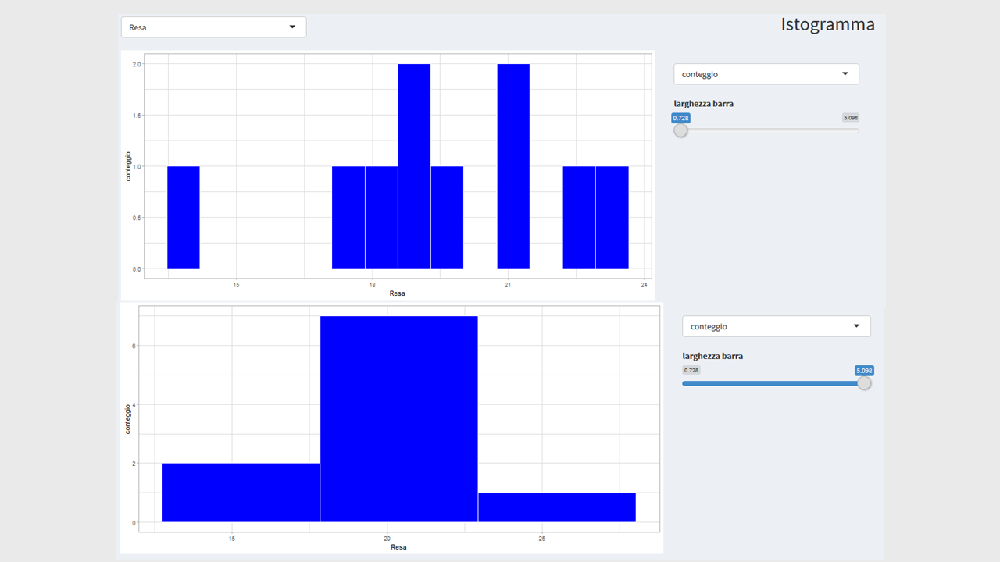
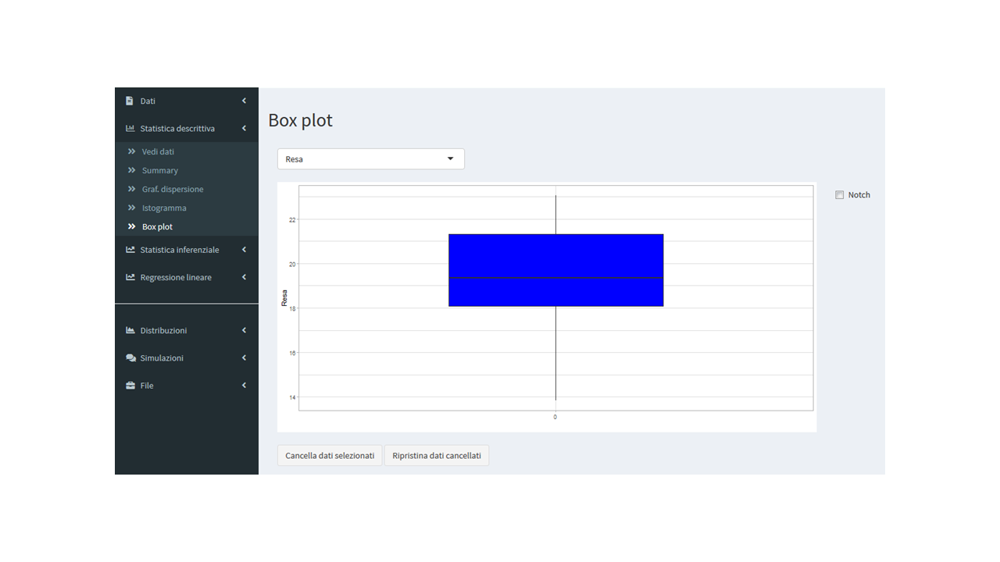

# Statistica descrittiva

```{r include=FALSE}
load("Dati/Descr.RData")
```

Si illustrano nel seguito alcuni strumenti della statistica descrittiva di uso molto comune per visualizzare e riassumere dati.

Dal menu "Dati" alla voce "Esempi Master" si può scegliere il file "Resa estrattiva" e vedere cosa contiene. Si tratta di una serie di dati, ottenuti dall'analisi di estratti vegetali. Il dataset consiste in 10 misure della resa estrattiva di un metodo di isolamento di polifenoli da infusi acquosi di Dittamo cretese (Origanum dictamus, meglio noto come Cretan tea), una pianta aromatica e medicinale tradizionalmente considerata un rimedio generale per molti disturbi (dalla stanchezza ai disturbi digestivi, alla capacità di agire come disinfettante e cicatrizzante).


```{r sd1, echo=FALSE, fig.align='center', fig.cap='Il dataset Resa estrattiva tra gli esempi didattici a disposizione per le lezioni del Master ECAIF', out.width="100%"}

```


La prima funzione descrittiva che di solito si usa è quella di mettere i dati in una tabella: nel menu "statistica descrittiva" la voce "Vedi dati" consente di stampare in una tabella le misure.

```{r sd2, echo=FALSE, fig.align='center', fig.cap='Il dataset Resa estrattiva rappresentato in forma di tabella', out.width="100%"}

```

L'informazione fornita da dieci numeri presentati in forma di elenco però può non essere molto utile, e pertanto spesso si preferisce presentare sia i valori grezzi in forma analitica sia i descrittori di posizione e dispersione dello stesso gruppo di dati. Selezionando la voce "Summary" dal menu "Statistica descrittiva", la funzione produce la stampa di media aritmetica (mean), deviazione standard (sd), intervallo interquartile (Inter-Quartile Range, IQR, differenza tra il terzo e il primo quartile, v. Glossario), valore minimo della serie (0%), valore al primo quartile (25%), mediana (50%, secondo quartile), valore al terzo quartile (75%), massimo (100%) e numero di dati su cui si calcola la statistica.

```{r sd3, echo=FALSE, fig.align='center', fig.cap='Indicatori di posizione e dispersione calcolabili dal dataset Resa estrattiva', out.width="100%"}

```

Il primo strumento grafico di immediata comprensione si ottiene con il comando "Graf. dispersione" che stampa il grafico a punti cosiddetto "a dispersione", per visualizzare i dati così come sono.
Nel grafico, le rese estrattive si leggono sulle ordinate, mentre in ascissa compare il numero di ordinamento dei dati. La linea blu orizzontale indica il valore della media.

```{r sd4, echo=FALSE, fig.align='center', fig.cap='Grafico di dispersione dei dati di Resa estrattiva', out.width="100%"}

```

Il grafico a punti può essere modificato introducendo le "etichette dei dati" che, in questo caso, coincidono con il numero di ordinamento dei dati.  

Nelle relazioni con dati, è molto frequente incontrare grafici a barre, chiamati Istogrammi. Per ottenere una rappresentazione dei dati del dataset in forma di istogramma è sufficiente selezionare la voce "Istogramma" del menu "Statistica descrittiva". L'istogramma è un grafico in cui in ordinata sono riportate le rese raggruppate in intervalli definiti attrverso il comando "larghezza barra". In ordinata invece è possibile scegliere la forma dei dati da riportare tra tre possibilità: il conteggio dei dati che cadono negli intervalli di resa identificati attraverso il comando "larghezza barra", la percentuale del numero di questi dati sul totale dei dati raccolti (percentuale = 100·numero di dati che cadono nell'intervallo dato/10) e la loro densità (densità = area della barra = percentuale/100).

```{r sd5, echo=FALSE, fig.align='center', fig.cap='Istogrammi dei dati di Resa estrattiva. In alto, la larghezza delle barre è la minima possibile; in basso la larghezza delle barre è la massima possibile', out.width="100%"}

```

Un altro importante strumento grafico è il "box-and-whiskers plot" (o boxplot), che si ottiene usando la funzione Box plot del menu "Statistica descrittiva". Il boxplot rappresenta in modo compatto in un unico grafico i maggiori descrittori dei dati.

```{r sd6, echo=FALSE, fig.align='center', fig.cap='Boxplot dei dati di Resa estrattiva', out.width="100%"}

```

In ascissa compare un numero di ordine della serie di dati (in questo abbiamo una unica serie e viene assegnato di default il valore "0" in ascissa), mentre in ordinata sono riportati i valori di resa etrattiva. La "scatola" si estende dal primo al terzo quartile, la riga centrale rappresenta la mediana e i baffi vanno dal valore minimo al valore massimo. I baffi permettono anche di identificare valori anomali (dati aberranti, outliers). Una convenzione grafica accettata è che i dati che cadono fuori dalla scatola ad una distanza di almeno 1.5 volte la dimensione della scatola siano da considerare con sospetto e siano soggetti a verifica con opportuni test per gli outliers (test di Dixon, Grubbs, Cochran o altri).
Si osservi che il valore 1.5 è definito in automatico arbitrariamente dalla routine e nei software di statistica "aperti" può essere modificato.