# Statistica inferenziale
```{r include=FALSE}
load("Dati/Infer.RData")
```

## Stime della media
### Una popolazione gaussiana

Riconsideriamo il dataset *Resa estrattiva* già visto nella parte di Statistica descrittiva:

```{r echo=FALSE}
Resa_estrattiva
```

A differenza del caso precedente, in cui le 10 misure formavano l'intera popolazione in esame, il dataset rappresenta un campione (aleatorio) della popolazione di tutte le misure teoricamente possibili. 

Siamo interessati ad ottenere informazioni su tutta la popolazione partendo dal campione (aleatorio) del risultato di
10 misure sperimentali. Ad esempio possiamo chiederci qual' è la media "vera" della nostra resa estrattiva o meglio come possiamo stimare tale valore a partire dai 10 risultati sperimentali.

Per fare ciò abbiamo bisogno di conoscere a priori la probabilità di distribuzione di ogni misura.  
Possiamo supporre che ogni misura sia data dalla media "vera" $\mu$ della nostra resa estrattiva più un errore sperimentale $\epsilon$ puramente casuale:
$$
y=\mu+\epsilon
$$
L'errore sperimentale $\epsilon$ può essere supposto distribuito come una normale di media $0$ e varianza $\sigma^2$
$$
\epsilon \sim N(0,\sigma^2)
$$
grazie ad un teorema fondamentale di calcolo delle probabilità (il *teorema centrale del limite*) che dimostra la verità di questa affermazione. Questo teorema afferma che la somma di variabili casuali aventi la stessa distribuzione di probabilità tende ad essere distribuita come una normale indipendentemente dalla loro distribuzione.

Ciò significa che il risultato di una singola misura (che è un valore casuale, dipendente dal campione) può assumere ad esempio i valori come nelle seguenti figure  
  
```{r echo=FALSE,out.width="35%"}

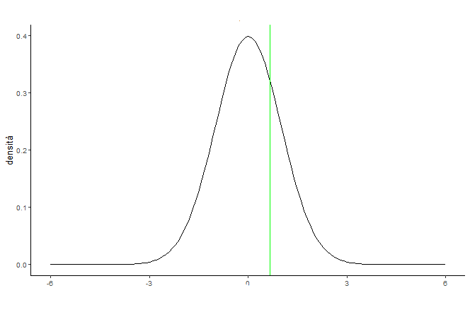
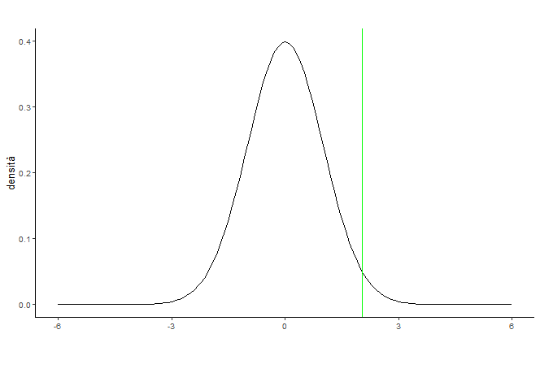
```

ma certamente sappiamo (sapendo che la sua distribuzione è una normale), ad esempio, che  il risultato della misura sarà nella zona bianca della figura seguente con una probabilità pari al 95%
  
```{r echo=FALSE,out.width="50%",fig.align='center'}
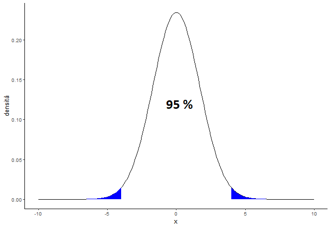
```

Altra importante ipotesi è che le misure siano indipendenti le une dalle altre, ossia che il risultato di ogni misura non sia influenzato in alcun modo da una misura precedente.

Osservazione: alla luce di quanto sopra, come devono essere eseguiti gli esperimenti, ad esempio nella costruzione di una curva di taratura?
E' corretta la prassi di predisporre i calibratori in ordine crescente di concentrazione?

Riassumendo: a partire dal risultato di $10$ misure distribuite come una normale di media $\mu$ e varianza $\sigma^2$
$$
y_i=\mu+\epsilon_i, \qquad \epsilon_i \sim N(0,\sigma^2)
$$
supponiamo che le misure siano tutte indipendenti tra loro e quindi ci poniamo il problema della stima della media "vera" della nostra resa estrattiva, ossia del parametro $\mu$.

Si noti che grazie al *teorema centrale del limite* è possibile alleggerire le ipotesi nel caso in cui il numero $m$ di osservazioni (la numerosità del campione) è grande, ad esempio $m>30$. In tal caso è sufficiente supporre che le misure siano identicamente distribuite (cioè che abbiano la stessa distribuzione di probabilità, non importa quale) e indipendenti tra loro.

#### Varianza $\sigma^2$ nota
In questo paragrafo supponiamo che la varianza $\sigma^2$ della popolazione sia nota a priori; nel paragrafo successivo ci occuperemo del caso (più frequente) in cui $\sigma^2$ non sia nota e dunque debba essere stimata.

A partire dal risultato delle $10$ misure sperimentali del nostro campione possiamo considerare la variabile $\bar{y}$, definita come la "media" delle $10$ misure
$$
\bar{y}=\frac{\sum_{i=1}^{10}y_i}{10}
$$
La variabile $\bar{y}$ è una variabile casuale (dipende dal campione di $10$ misure che è estratto in modo casuale dalla popolazione) ma, grazie alle proprietà della distribuzione normale delle $y_i$ e all'ipotesi di indipendenza delle misure, è facile dimostare che essa - la media delle misure- è distribuita come una normale di media $\mu$ e varianza $\sigma^2/10$
$$
\bar{y}\sim N(\mu,\sigma^2/10)
$$
La quantità $\sigma/\sqrt{10}$ è chiamata *errore standard della media* 
(Attenzione! da non confondere con la deviazione standard dalla media)

```{r echo=FALSE,out.width="50%",fig.align='center'}
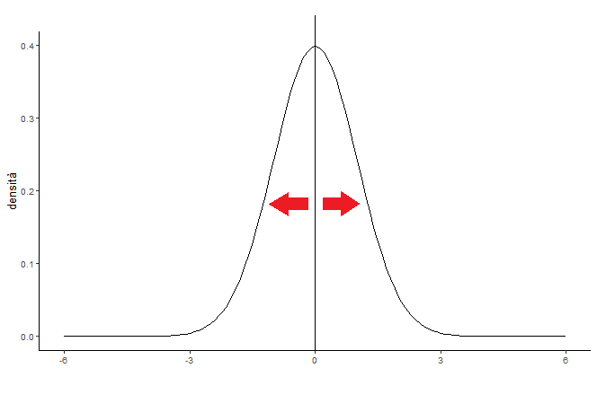
```

ed è un indicatore della variazione della stima puntuale $\bar{y}$ della media $\mu$ (proprietà che chiamiamo "precisione" della stima e che coincide con la qualità della stima stessa; una stima di "buona" qualità è un dato che ha piccolo errore standard ossia alta precisione). 
L'*errore standard della media* $\sigma/\sqrt{m}$ diminuisce all'aumentare della numerosità $m$ del campione. Per aumentare la precisione occorre quindi aumentare il numero di campioni (nel nostro esempio la precisione della stima con $m=10$ può essere migliorata se aumentiamo m, il numero dei campioni, per fissare le idee poniamo $m=20$).

##### Intervallo di confidenza

La stima puntuale $\bar{y}$ del parametro $\mu$ è una risposta piuttosto grossolana al problema di determinare una buona approssimazione del valore vero incognito.
In particolare ricordiamo che il valore stimato sperimentalmente non sarà mai uguale al valore vero (per di più, per definizione, il valore vero non è nemmeno noto...).

Vediamo quindi come possiamo determinare una stima per intervalli del parametro $\mu$: cerchiamo di definire il cosiddetto "intervallo di confidenza".

Grazie alle note proprietà della normale si può dimostrare che:

$$
\bar{y}-\mu \sim N(0,\sigma^2/10)
$$
e che 

$$
\frac{\bar{y}-\mu}{\sigma\sqrt{1/10}} \sim N(0,1)
$$

Riassumendo: a partire dal risultato delle $10$ misure abbiamo calcolato la variabile $\frac{\bar{y}-\mu}{\sigma\sqrt{1/10}}$. Essa è una variabile casuale (dipende dal campione di $10$ misure che è stato estratto in modo casuale dalla popolazione) di cui conosciamo la distribuzione di probabilità.

Nel menù Simulazione /Stima della media del programma è possibile simulare quanto detto. Supponiamo che la media della popolazione
(che a priori non conosciamo) sia $\mu=19$, che la deviazione standard sia $\sigma=2.7$ e che la numerosità del campione sia $m=10$

```{r echo=FALSE,out.width="50%",fig.align='center'}
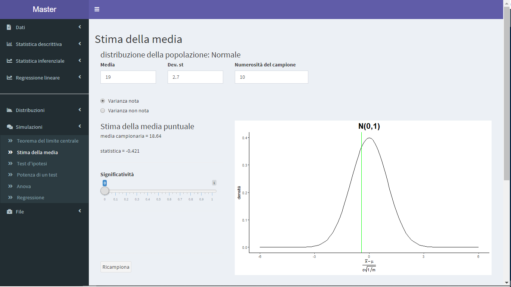
```

cliccando sul bottone *Ricampiona* si simula il risultato $\frac{\bar{y}-\mu}{\sigma\sqrt{1/10}}$ ottenuto da $10$ nuove misure sperimentali (cioè da un nuovo campione casuale di numerosità $10$ della popolazione in esame)

```{r echo=FALSE,out.width="35%"}
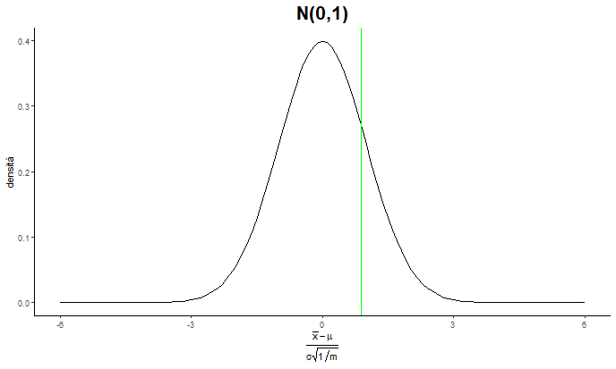
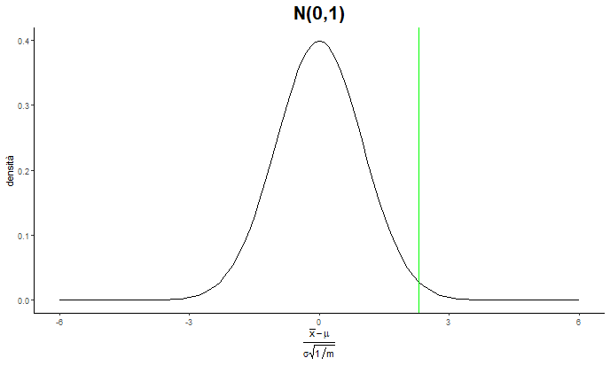
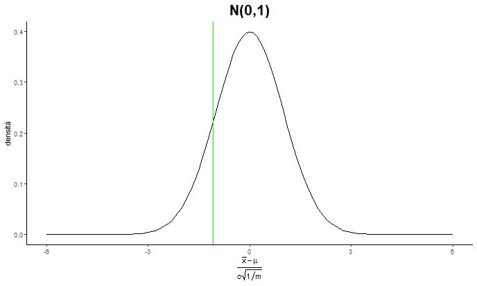
```

Fissando la significatività ad esempio a $0.05$ si ha che $\frac{\bar{y}-\mu}{\sigma\sqrt{1/10}}$ ha il $95$% di probabilità di assumere valori (la linea verde) nella regione bianca, come ad esempio in figura

```{r echo=FALSE,out.width="50%",fig.align='center'}
knitr::include_graphics("Immagini/Inferenziale/simulazione_media4.png")
```

Riprendiamo la costruzione dell'intervallo di confidenza. Fissiamo un valore $\alpha$ compreso tra $0$ e $1$ (in generale si fissa $\alpha=0.05$). Indichiamo con $z_{\alpha/2}$ il quantile di ordine $1-\alpha/2$ della distribuzione normale $N(0,1)$, ossia quel numero reale per cui una variabile $z$ casuale distribuita come $N(0,1)$ abbia probablità $1-\alpha/2$ di assumere valore minore di $z_{\alpha/2}$
$$
\mathbb{P}[z < z_{\alpha/2}] = 1-\alpha/2
$$

In particolare, essendo $\frac{\bar{y}-\mu}{\sigma\sqrt{1/10}} \sim N(0,1)$, avremmo che

$$
\mathbb{P}[\frac{\bar{y}-\mu}{\sigma\sqrt{1/10}} < z_{\alpha/2}] = 1-\alpha/2
$$

Nell'esempio del simulatore, $z_{\alpha/2}$ indica il valore sulle ascisse di confine destro tra la zona blu e la zona bianca.

Abbiamo quindi

$$
\mathbb{P}[- z_{\alpha/2}<\frac{\bar{y}-\mu}{\sigma\sqrt{1/10}} < z_{\alpha/2}] = 1-\alpha
$$

che, sempre nell'esempio del simulatore, è la probabilità che la linea verde cada nella zona bianca (vedi figura sopra).

Possiamo quindi costruire il seguente *intervallo di confidenza di livello $\alpha$*
$$
\bar{y} \pm z_{\alpha/2} \sigma \sqrt{1/10}
$$
Questo  un intervallo aleatorio, perché dipende dal campione di $10$ misure (estratto in modo casuale dalla popolazione). Nel simulatore, infatti, se clicchiamo sul bottone *Ricampiona* otteniamo intervalli diversi.

```{r echo=FALSE,out.width="35%"}
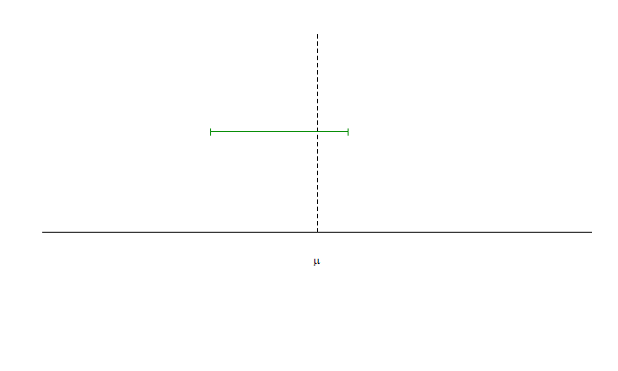
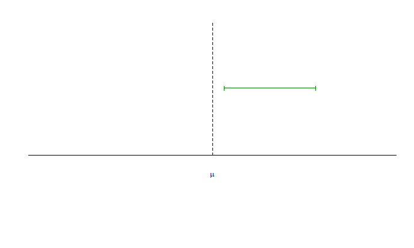
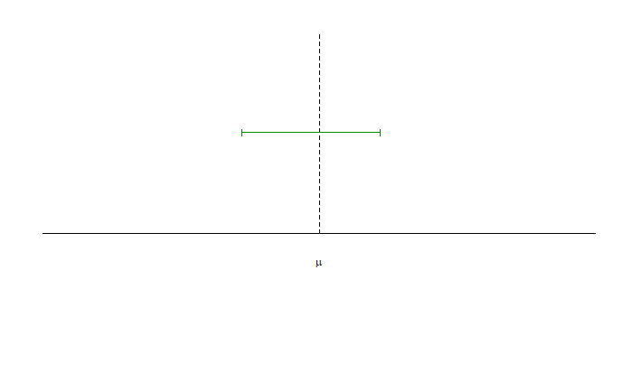
```

L'*intervallo di confidenza di livello $\alpha$* ha come caratteristica questa proprietà. Ripetendo un numero elevato di volte la costruzione dell'intervallo a partire da un nuovo campione ($10$ nuove misure sperimentali) circa $1-\alpha$ di questi intervalli contiene il valore $\mu$.
Nel simulatore, cliccando un numero elevato di volte il bottone *Ricampiona*, circa il $95\%$ degli intervalli costruiti conterrà la linea tratteggiata verticale (valore di $\mu$)

##### Test di ipotesi

A partire da quanto detto è possibile anche fare il seguente test di ipotesi sulla media:
$$
 H_0: \mu=\mu_0 \quad \rm{vs} \quad H_1: \mu \neq \mu_0 \quad 
$$
cioè supponiamo che la media "vera" $\mu$  sia uguale ad un certo valore $\mu_0$ e vediamo se le informazioni ricavabili dal nostro campione di $10$ misure sono tali da portarci a confutare questa ipotesi.
La procedura di esecuzione di un test di ipotesi è sempre la stessa ed inizia formulando la affermazione seguente: consideriamo l'ipotesi $\mu=\mu_0$ vera fino "a prova contraria".

Fissato un valore $\alpha$ per quanto sopra detto, nell'ipotesi $\mu=\mu_0$, abbiamo che 

$$
\mathbb{P}[- z_{\alpha/2}<\frac{\bar{y}-\mu_0}{\sigma\sqrt{1/10}} < z_{\alpha/2}] = 1-\alpha
$$

Ad esempio nel menù Simulazioni/Test d'ipotesi, ragionando come sopra,  

```{r echo=FALSE,out.width="50%",fig.align='center'}
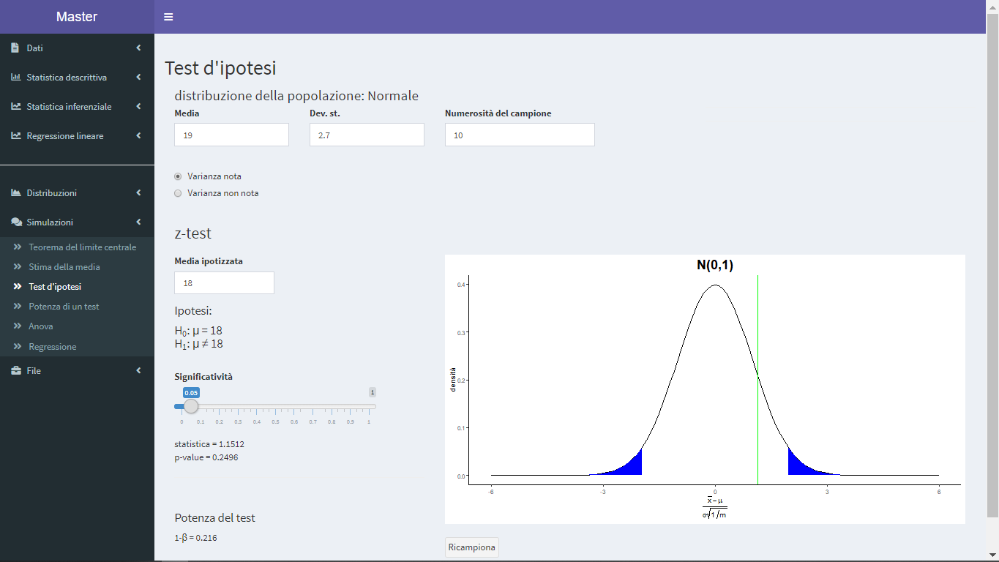
```

supponendo $\mu=18$, cliccando sul bottone *Ricampiona* si simula il risultato $\frac{\bar{y}-\mu_0}{\sigma\sqrt{1/10}}$ ottenuto da $10$ nuove misure sperimentali (cioè da un nuovo campione casuale di numerosità $10$ della popolazione in esame)

```{r echo=FALSE,out.width="35%"}
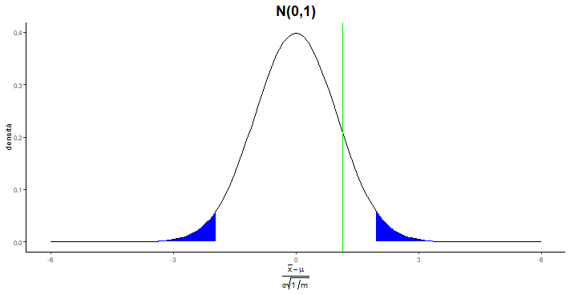
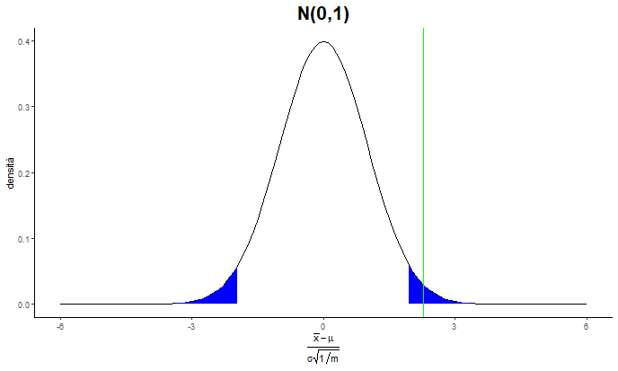
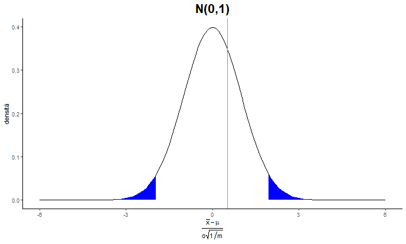
```

Siccome noi supponiamo vera l'ipotesi nulla $H_0$, il $95 \%$ ($\alpha=0.05$) delle volte il valore $\frac{\bar{y}-\mu_0}{\sigma\sqrt{1/10}}$ deve cadere nella zona bianca mentre il restante $5 \%$ cade nella zona blu *Regione Critica*.

Accettiamo l'ipotesi nulla $H_0$ se la stima $\frac{\bar{y}-\mu_0}{\sigma\sqrt{1/10}}$ non cade nella *Regione Critica* (primo e terzo caso caso nella figura precedente) infatti, in tal caso non abbiamo evidenza statistica per rifiutare l'ipotesi nulla, mentre rifiutiamo l'ipotesi nulla nel caso contrario (secondo caso figura precedente).
In tal caso diremo che $\mu$ è diversa da $\mu_0$ al livello di significatività $\alpha$ (o che $\mu$ è significativamente diversa da $\mu_0$ al livello  $\alpha$).
Si osservi che $\alpha$ è la probabilità di rifiutare l'ipotesi nulla $H_0$ quando questa è vera (errore di tipo I) e, ovviamente, si vuole che tale probabilità sia piccola.

Per eseguire il test nell'esempio *Resa estrattiva* si procede come segue: si carica il dataset nel menù Statistica inferenziale/Test media. Si sceglie il caso di una popolazione, si indica il valore della deviazione standard nota (N.B. stiamo supponendo che $\sigma$ sia nota a priori), ad esempio $\sigma =2.7$ e si indica infine la media ipotizzata, ad esempio $\mu_0=18$. Quindi si fissa la significatività $\alpha$, ad esempio $\alpha=0.05$. Abbiamo evidenza statistica per rifiutare $H_0$ se la linea verde (che indica il valore $\frac{\bar{y}-\mu_0}{\sigma\sqrt{1/10}}$ calcolato dal nostro campione) è nella *Regione Critica*, ossia cade nella regione blu. In caso contrario accettiamo $H_0$ non avendo evidenza statistica per rifiutarla.
Attenzione! Non abbiamo provato che $H_0$ è *vera* (ipotesi a priori). Il responso del test di ipotesi è che le informazioni contenute nel nostro campione (la media e la deviazione standard) non sono tali da fornire prove sufficienti per rifiutarla e dire quindi che la media del campione è diversa da quella della popolazione al livello di significatività $\alpha=0.05$.

Un importante indicatore di un test d'ipotesi è il *p-value*. E' la probabilità che una variabile aleatoria distribuita come la $N(0,1)$ assuma valori (in valore assoluto) maggiori di $\frac{\bar{y}-\mu_0}{\sigma\sqrt{1/10}}$

$$
\mathbb{P}[|z|>|\frac{\bar{y}-\mu_0}{\sigma\sqrt{1/10}}|], \qquad z \sim N(0,1)
$$

Il *p-value* è il più piccolo valore di $\alpha$ per cui abbiamo evidenza statistica per rifiutare $H_0$. E il "vero" livello di significatività per cui rifiutiamo $H_0$.

Accettiamo $H_0$ se il *p-value* è maggiore di $\alpha$ (immagine a destra nella figura sottostante) e rifiutiamo $H_0$ nel caso contario (immagine a sinistra nella figura sottostante)

```{r echo=FALSE,out.width="50%"}
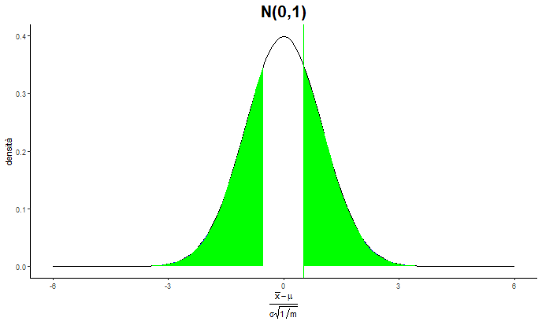
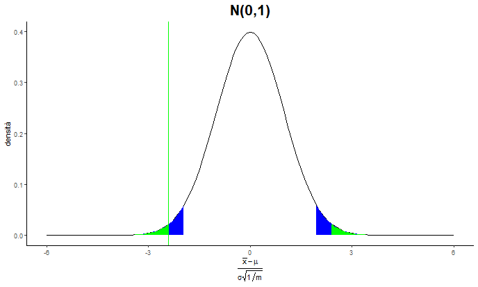
```


Ragionando con l'*intervallo di confidenza*, accettiamo $H_0$ se $\mu_0$ appartiene all'intervallo, in caso contrario rifiutiamo $H_0$.

Il valore del *p-value* e gli estremi dell'*intervallo di confidenza*, così come il valore della statistica $\frac{\bar{y}-\mu_0}{\sigma\sqrt{1/10}}$, si ottengono nel menù Statistica inferenziale/Test media: una popolazione

```{r echo=FALSE,out.width="50%",fig.align='center'}
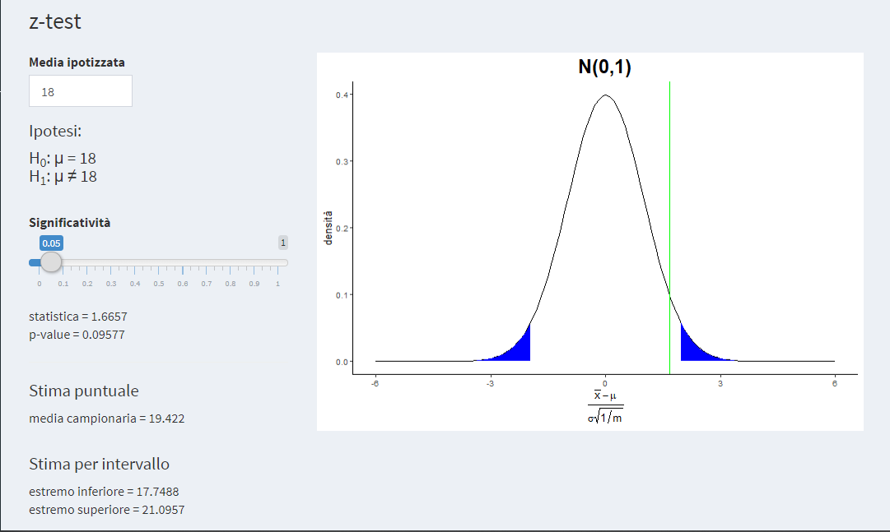
```

#### Verifica delle ipotesi

Dobbiamo verificare che le $10$ misure sperimentali provengano da una popolazione normale. Questa è l'ipotesi fondamentale da cui siamo partiti affiché tutto ciò detto fin qui sia valido. Ricordiamo che nel caso in cui il campione si sufficientemente grande (ad esempio $m>30$) questa ipotesi si può attenuare grazie al *teorema centrale del limite*. In tal caso è sufficiente supporre che le misure siano identicamente distribuite (cioè che abbiano la stessa distribuzione di probabilità, non importa quale).

L'ipotesi di normalità può essere verificata mediante un grafico che riporta in ascissa i quantili della $N (0 , 1)$ e in ordinate i quantili della distribuzione campionaria dei dati. Tanto più i quantili sono allineati tanto più i dati confermano l'ipotesi di normalità.

Esiste anche un test d'ipotesi specifico, il *test di Shapiro-Wilk*, considerato uno dei più potenti per la verifica della normalità, soprattutto per campioni poco numerosi. Il test confronta una varianza ottenuta usando pesi particolari con la
varianza campionaria. Indicato con $W$ il rapporto tra le due stime della varianza ($0 < W < 1$), nell'ipotesi di
normalità (ipotesi nulla $H_0$) si rifiuta l'ipotesi nulla per valori di W troppo piccoli. Il risultato del test è il parametro $W$ a cui è associato un *p-value*. Il significato rimane quello detto per cui un *p-value* sufficientemente piccolo 
($p < \alpha$) è un indice della probabilità che la distribuzione non sia normale.

```{r echo=FALSE,out.width="50%",fig.align='center'}
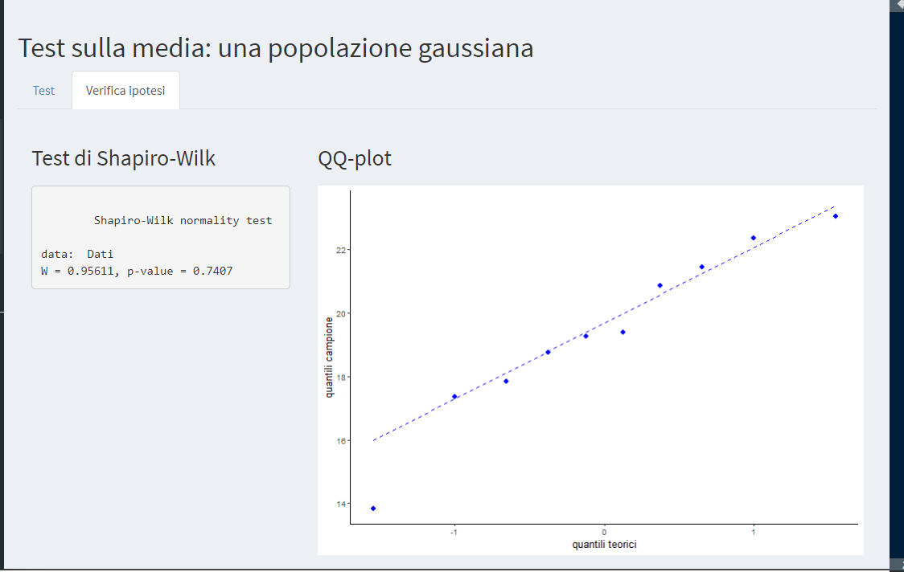
```

La figura rappresenta la verifica di ipotesi eseguita per l'esempio considerato (menù Statistica inferenziale/Test media: una popolazione - pagina Verifica ipotesi)

Quanto illustrato in questo paragrafo in merito ai testi di ipotesi è valido in tutto il capitolo. Per verificare le ipotesi si segue la procedura descritta a partire dalla formulazione della ipotesi nulla, si calcola la statistica del test di interesse (in questo caso, la W di Shapiro-Wilk) e si stabilisce dal valore del parametro stimato se l'ipotesi nulla può essere accettata ($H_0$: la distribuzione dei dati è normale) o deve essere rifiutata ($H_1$: la distribuzione non è normale).

#### Varianza $\sigma^2$ non nota

In questo caso dobbiamo stimare anche $\sigma^2$. Una stima puntuale della varianza $\sigma^2$ è data da
$$
s^2 = \frac{1}{m-1}\sum_{j=1}^m (y_j-\bar y)^2.
$$
($m=10$ nel nostro esempio).

Si può quindi dimostrare che 
$$
\frac{\bar y - \mu}{s \sqrt{1/m}} \sim t(m-1),
$$
dove $t(m-1)$ è la distribuzione di Student a $m-1$ gradi di libertà.

Come si vede dalla figura sottostante la forma della $t$ di Student dipende dai gradi di libertà e, al crescere di questi ultimi, si "avvicina" alla normale $N(0,1)$. Chiaramente il dover stimare anche $\sigma$ fa perdere un po' di precisione che "migliora" però al crescere della numerosità campionaria.

```{r echo=FALSE,out.width="50%",fig.align='center'}
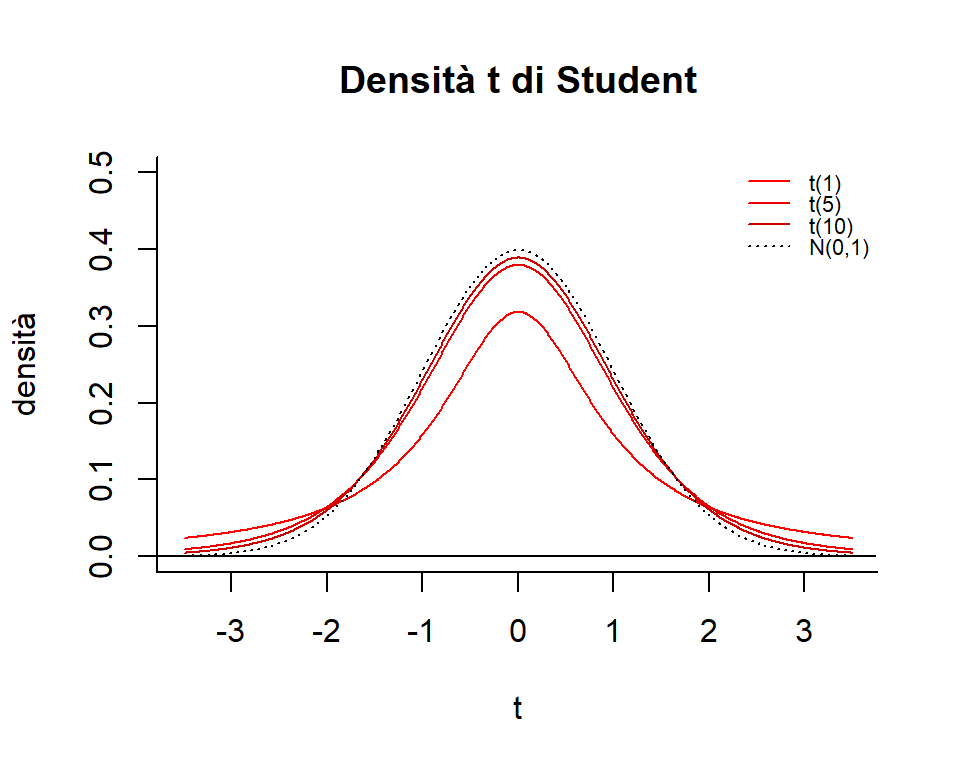
```

La quantità $s$ nella formula precedente è la deviazione standard del campione,
è una stima - consistente non distorta - della deviazione standard della popolazione.   
La quantità $s \sqrt{1/m}$ è *l'errore standard della media*, 
ossia la stima della deviazione standard della media. 
È dunque una stima della variabilità della stima della media, cioè una misura della sua imprecisione.  

Grazie alla conoscenza della distribuzione di probabilità di $\frac{\bar y - \mu}{s \sqrt{1/m}}$ , possiamo ragionare come nel paragrafo precedente, e fare inferenza per $\mu$.

Fissiamo un valore $\alpha$ compreso tra $0$ e $1$ (in generale si fissa $\alpha=0.05$). Indichiamo con $t_{\alpha/2}$ il quantile di ordine $1-\alpha/2$ della distribuzione normale $t(m-1)$, ossia quel numero reale per cui una variabile $t$ casuale distribuita come $t(m-1)$ abbia probablità $1-\alpha/2$ di assumere valore minore di $t_{\alpha/2}$
$$
\mathbb{P}[t < t_{\alpha/2}] = 1-\alpha/2
$$

* *intervallo di confidenza* 
$$
\bar{y} \pm t_{\alpha/2}s\sqrt{1/m}
$$

* *test d'ipotesi (t-test)*
$$
 H_0: \mu=\mu_0 \quad \rm{vs} \quad H_1: \mu \neq \mu_0 \quad 
$$

Come nel caso della varianza nota vanno verificate le ipotesi. Si procede esattamente come quanto visto nel paragrafo precedente.

Tornando al nostro esempio: supponiamo che da un altro gruppo di esperimenti sulla stessa pianta si ottiene il
valore medio di $18.02$. Vogliamo verificare se possiamo accettare l'ipotesi nulla $\mu_0=18.02$. Ci chiediamo "$18.02$ e $19.42$ (media campionaria) sono 
statisticamente distinguibili"?
(N.B. il fatto che due dati siano *numericamente diversi* non vuole dire che lo siano anche *statisticamente*. Questo è l'oggetto della verifica in questione).
Per eseguire il test  si procede come nel caso precedente: una volta caricato il dataset, nel menù Statistica inferenziale/Test media si sceglie il caso di una popolazione e si clicca su *Varianza non nota*, si indica infine la media ipotizzata, ad esempio $\mu_0=18.02$. Quindi si fissa la significatività $\alpha$, ad esempio $\alpha = 0.05$.
Abbiamo evidenza statistica per rifiutare $H_0$ se la linea verde (che indica il valore $\frac{\bar{y}-\mu_0}{\sigma\sqrt{1/10}}$ calcolato dal nostro campione) è nella *Regione Critica*, ossia cade nella regione blu. In caso contrario accettiamo $H_0$ non avendo evidenza statistica per rifiutarla.

Il valore del *p-value* e gli estremi dell'*intervallo di confidenza*, così come il valore della statistica $\frac{\bar{y}-\mu_0}{\sigma\sqrt{1/10}}$, si ottengono nel menù Statistica inferenziale/Test media: una popolazione

```{r echo=FALSE,out.width="50%",fig.align='center'}
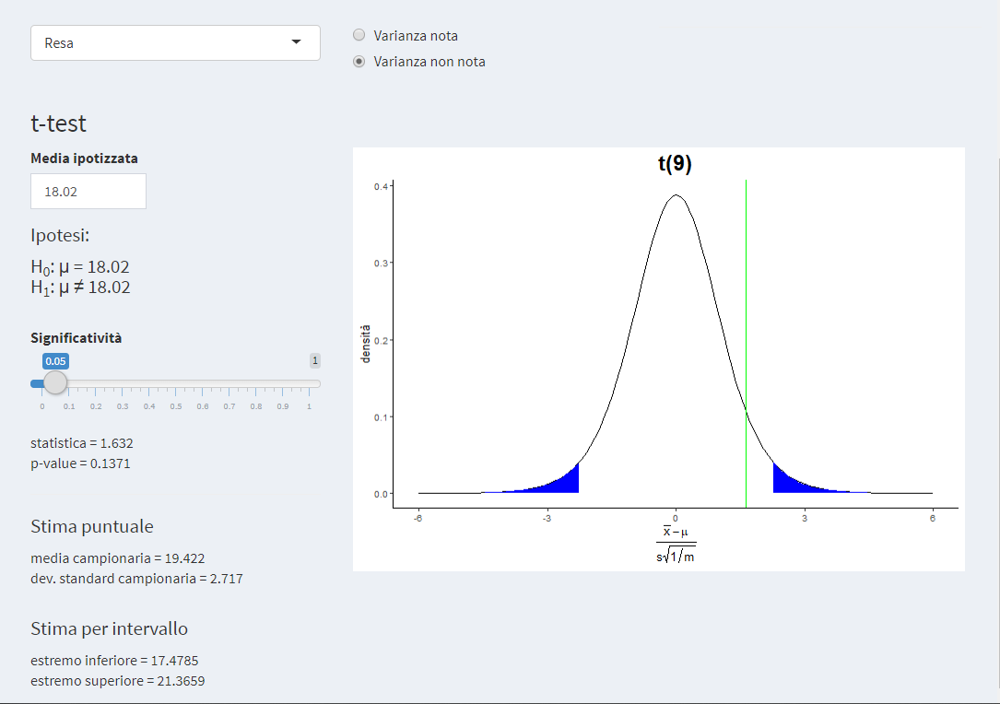
```


   
### Due popolazioni gaussiane: campioni accoppiati
Consideriamo il dataset *Diuretico*

```{r echo=FALSE}
Diuretico
```
Il dataset consiste nell'elenco dei valori di volume di urina escreta da 12 pazienti volontari a cui sono stati somministrati 2 diuretici differenti qui denominati A e B.  La prima colonna della tabella ("Paziente"), riporta il codice identificativo di ogni paziente. Quindi, in questo caso i campioni sono accoppiati in quanto in ogni riga le misure si riferiscono ai volumi di urina raccolti in seguito alla somministrazione del *Diuretico.A* e del *Diuretico.B* allo stesso paziente.  

Cade perciò l'ipotesi di indipendenza dei campioni perché, in ciascun paziente, il volume di urina escreto per effetto del diuretico A non è indipendente da quello escreto per effetto del diuretico B: il legame tra i due dati sperimentali è rappresentato dal paziente stesso. Ciascuna coppia di volumi di urina è determinata dalla fisiologia del paziente in esame. Quindi non si può applicare quanto detto finora sui test d'ipotesi e bisogna ridefinire la variabile aleatoria.
Si sceglie quindi di trasformare le $24$ misure non indipendenti tra loro a coppie, in $12$ differenze indipendenti tra loro e su questa «nuova» variabile si applica il test più appropriato ($z$ se sigma nota, $t$ altrimenti).

Per eseguire il test  si procede come segue: una volta caricato il dataset bisogna definire la natura delle variabili (la variabile *Paziente* è qualitativa mentre le altre $2$ variabili $Diuretico.A$ e $Diuretico.B$ sono quantitative) selezionando  in Dati/Variabili/Variabili quantitative *Paziente* come variabile qualitativa

```{r echo=FALSE,out.width="50%",fig.align='center'}

```

Nel menù Statistica inferenziale/Test media si sceglie il caso di due popolazione e si seleziona la pagina Test:dati accoppiati. Non conoscendo a priori la varianza della variabile differenza si clicca su *Varianza non nota*, si indica infine la media della differenza ipotizzata, ad esempio $\mu_0=0$. Quindi si fissa la significatività $\alpha$, ad esempio $\alpha = 0.05$.
Abbiamo evidenza statistica per rifiutare $H_0$ se la linea verde (che indica il valore $\frac{\bar{y}-\mu_0}{\sigma\sqrt{1/10}}$ calcolato dal nostro campione) è nella *Regione Critica*, ossia cade nella regione blu. In caso contrario accettiamo $H_0$ non avendo evidenza statistica per rifiutarla.

Il valore del *p-value* e gli estremi dell'*intervallo di confidenza*, così come il valore della statistica $\frac{\bar{y}-\mu_0}{\sigma\sqrt{1/10}}$, si ottengono nel menù Statistica inferenziale/Test media: una popolazione

```{r echo=FALSE,out.width="50%",fig.align='center'}
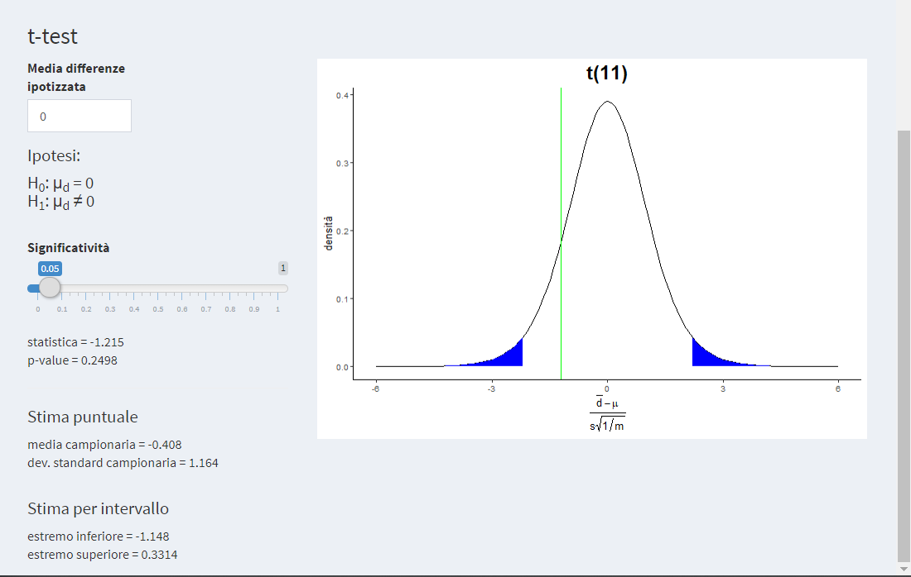
```

### Due popolazioni gaussiane: campioni indipendenti
Consideriamo il dataset *Resa estrattiva gruppi*

```{r echo=FALSE}
Resa_estrattiva_gruppi
```
  
che consiste nelle $10$ misure sperimentali della *Resa estrattiva* considerate nei
paragrafi precedenti a cui è aggiunta una variabile qualitativa (fattore a 2 livelli) *Gruppo* in cui è
indicato il gruppo (pianta $a$ e pianta $b$) a cui appartiene la misura i-esima.  

Possiamo rappresentare i dati in 2 colonne (una colonna per pianta) come segue

```{r echo=FALSE}
X=cbind(Resa_estrattiva_gruppi[Resa_estrattiva_gruppi$Gruppo=="a",1],
      Resa_estrattiva_gruppi[Resa_estrattiva_gruppi$Gruppo=="b",1])
colnames(X)=c("Resa.a","Resa.b")
row.names(X)=c(1:5)
X
```

Ragionando (colonna per colonna) come fatto nel primo paragrafo, possiamo modellizzare le 5 misure per ogni gruppo come
$$
y_{ia}=\mu_a+\epsilon_{ia} \qquad y_{i5}=\mu_b+\epsilon_{ib}
$$
dove $\mu_a$ e $\mu_b$ sono rispettivamente la media "vera" della resa estrattiva della pianta $a$ e la media "vera" della resa estrattiva della pianta $b$ e
$$
\epsilon_{ia}\sim N(0,\sigma_a^2) \qquad  \epsilon_{ib}\sim N(0,\sigma_b^2)
$$
indipendenti.

#### Varianze $\sigma^2_a$ e $\sigma^2_b$ note
Una stima puntuale di $\mu_a$ e $\mu_b$ è data rispettivamente da
$$
\bar y_a = \frac{1}{m_a}\sum_{i=1}^{m_a} y_{aj} \qquad 
\bar y_b = \frac{1}{m_b}\sum_{i=1}^{m_b} y_{bj}
$$

Si può provare che
$$
\frac{(\bar y_a - \bar y_b)-(\mu_a-\mu_b)}{\sqrt{\sigma^2_a/m_a+\sigma^2_b/m_b}} \sim N(0,1)
$$
Si può applicare quanto detto nel primo paragrafo e si usa il *z-test* per valutare la differenza delle medie

#### Varianze $\sigma^2_a$ e $\sigma^2_b$ non note

Se le varianze non sono note, si deve stimare anche la varianza e in questo si può usare la media ponderata delle varianze dei due campioni che è uno stimatore migliore delle singole varianze di ciascun campione.
Introduciamo la *varianza combinata*
$$
s_c^2 = \frac{(m_a+1)s_a^2+(m_b+1)s_b^2}{m_a+m_b-2}.
$$

Si può dimostrare che se $\sigma^2_a=\sigma^2_b$  

$$
\frac{(\bar y_a - \bar y_b)-(\mu_a-\mu_b)}{s_c\sqrt{1/m_a+1/m_b}} \sim t(m_a+m_b-2)
$$

mentre nel caso in cui non possiamo supporre che le varianze siano uguali i gradi di libertà $\nu$ della distribuzione $t$ possono essere approssimati dalla *formula di Welch* 
$$
\nu \approx \frac{\frac{s^2_a}{m_a}+\frac{s^2_b}{m_b}}{\frac{s^2_a}{m_a^2(m_a-1)}+\frac{s^2_b}{m_b^2(m_b-1)}}
$$
e quindi

$$
\frac{(\bar y_a - \bar y_b)-(\mu_a-\mu_b)}{s_c\sqrt{1/m_a+1/m_b}} \sim t(\nu)
$$

I gradi di libertà stimati dalla *formula di Welch* sono minori dei gradi di libertà nel caso in cui le varianze siano uguali. Il test risulta quindi “meno potente nel distinguere le medie”.   
Vediamo quanto detto con il nostro esempio.

Per eseguire il test  si procede come segue: una volta caricato il dataset bisogna definire la natura delle variabili (la variabile *Gruppo* è qualitativa mentre la variabile $Resa$ è quantitativa) selezionando  in Dati/Variabili/Variabili quantitaive *Gruppo* come variabile qualitativa.

Nel menù Statistica inferenziale/Test media si sceglie il caso di due popolazioni e si seleziona la pagina Test:dati indipendenti. Non conoscendo a priori le varianze si clicca su *Varianza non nota*, e quindi scegliere l'opzione Varianze uguali/Varianze non uguali a seconda del caso (nel paragrafo successivo descriviamo un test per la verifica dell'uguaglianza delle variabili).
Si fissa la significatività $\alpha$, ad esempio $\alpha = 0.05$ e si prosegue come già visto (figura a sinistra caso varianze uguali, figura a destra varianze non uguali)

```{r echo=FALSE,out.width="50%"}
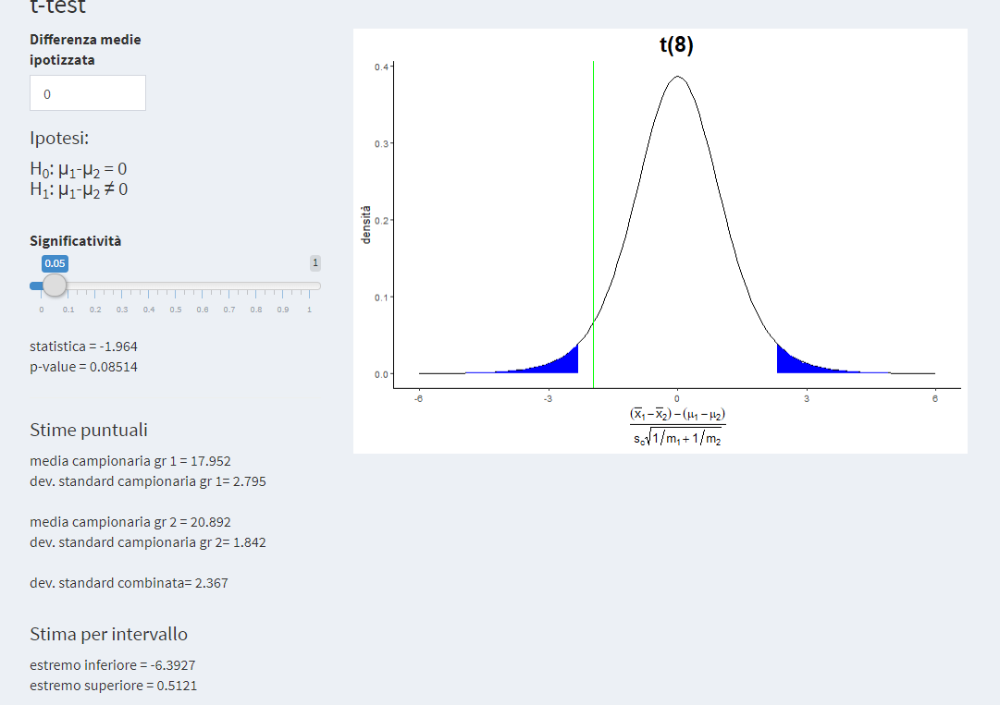
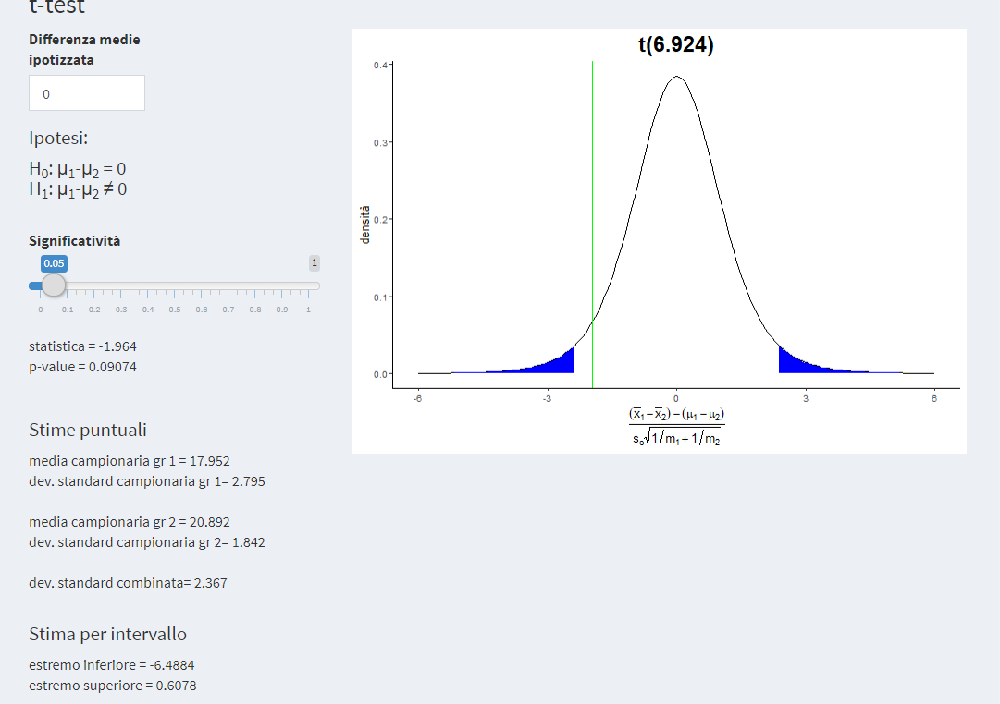
```

I gradi di libertà stimati dalla *formula di Welch* sono $\nu = 6 . 924$ (figura a destra) minori di $8$ (gradi di libertà
nel caso in cui le varianze siano uguali). Come già osservato il test è quindi “meno potente nel distinguere le medie”. 
Questo lo si nota dal valore del *p-value* che risulta maggiore e dall’intervallo di confidenza che risulta più ampio.


##### F-test

Per quanto appena visto abbiamo bisogno di verificare l'ipotesi di uguaglianza delle varianze dei due campioni.  

E’ nota la distribuzione del rapporto tra la stima delle varianze e le varianze di popolazione:
$$
\frac{s^2_a/\sigma^2_a}{s^2_b/\sigma^2_b} \sim F(m_a-1,m_b-1)
$$
Si tratta della distribuzione F di Fisher (in figura per alcune combinazioni di gradi di libertà)

```{r echo=FALSE,out.width="50%",fig.align='center'}
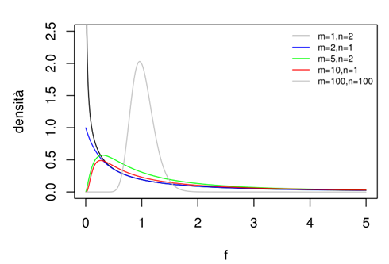
```

Ragionando in maniera analoga a quanto fatto nel capitolo per i test $t$ e $z$ possiamo eseguire il cosiddetto $F-test$ delle varianze
$$
H_0: \sigma^2_a=\sigma^2_b  \quad \rm{vs} \quad H_1: \sigma^2_a \neq \sigma^2_b 
$$
L'intervallo di confidenza è definito 

$$
\frac{s^2_a}{s^2_b}\frac{1}{f_{\alpha/2}} \leq \frac{\sigma^2_a}{\sigma^2_b} \leq 
\frac{s^2_a}{s^2_b}\frac{1}{f_{1-\alpha/2}}
$$
dove $f_{\alpha/2}$ indica il quantile di ordine $1-\alpha/2$ della distribuzione $F(m_a-1,m_b-1)$,
i.e. $\mathbb{P}[f \geq f_{\alpha/2}]=\alpha/2$, $f\sim F(m_a-1,m_b-1)$.


Per meglio comprendere, vediamo come eseguire il test.   
Nel menù Statistica inferenziale/Test test varianza:due popolazioni si fissa la significatività $\alpha$, ad esempio $\alpha = 0.05$.
Abbiamo evidenza statistica per rifiutare $H_0$ se la linea verde (che indica il valore $s_a^2/s_b^2$ calcolato dal nostro campione) è nella *Regione Critica*, ossia cade nella regione blu. In caso contrario accettiamo $H_0$ non avendo evidenza statistica per rifiutarla.

```{r echo=FALSE,out.width="50%",fig.align='center'}
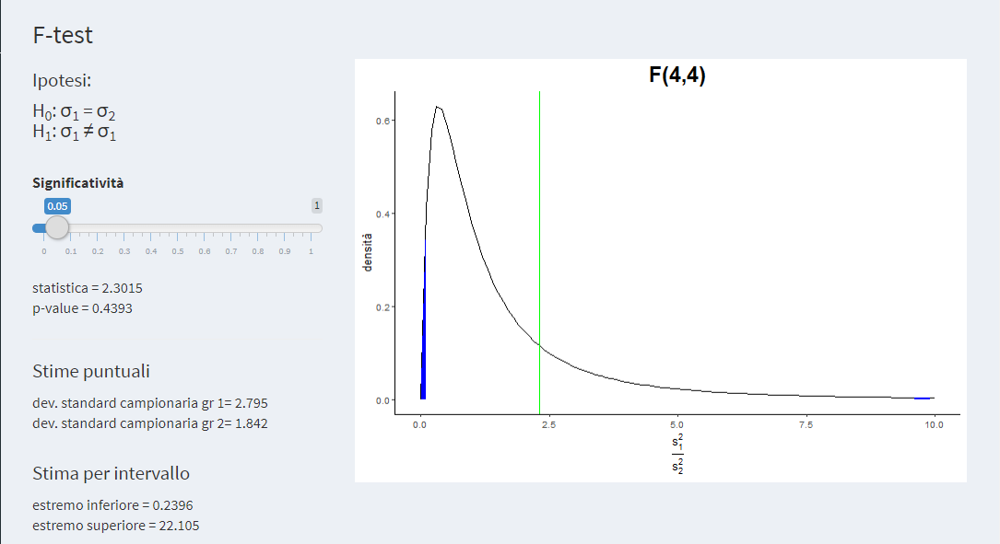
```

Si ottengono il valore del *p-value* e gli estremi dell'*intervallo di confidenza*. 

Si noti che in questo caso stiamo verificando l'ipotesi nulla che postula che il rapporto tra le varianze è uguale a 1. Ragionando per intervallo di confidenza abbiamo evidenza statistica per rifiutare $H_0$ se tale intervallo non contiene $1$, in caso contrario non abbiamo evidenza per rifiutare $H_0$.


