# Regressione lineare semplice
```{r include=FALSE}
load("Dati/Regr.RData")
```

Ricordiamo brevemente l'equazione di una retta su un piano di coordinate $(x,y)$:
$$
y=\beta_0+\beta_1x
$$
il cui grafico è dato da

```{r echo=FALSE,out.width="50%",fig.align='center'}
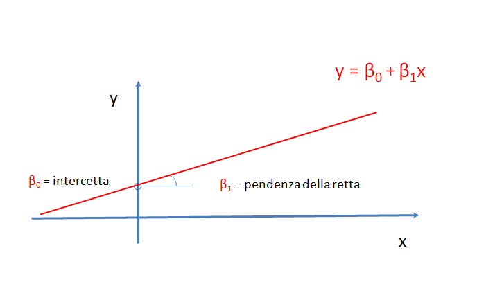
```

dove $\beta_0$ è l'intercetta, ossia il valore della $y$ per $x=0$, e $\beta_1$ è la pendenza della retta e indica di quanto cresce (o decresce) la $y$ all'aumentare di un'unità nella $x$.


Supponiamo ora di dover costruire la retta di taratura  (i.e. determinare i parametri $\beta_0$ e $\beta_1$) di uno strumento per la determinazione  delle proteine totali in colture cellulari. L'esperimento consiste nel leggere l'assorbanza misurata $y$ da uno spettofotometro per concentrazioni note $x$. I dati sperimentali sono indicati nella seguente tabella

```{r echo=FALSE}
Assorbanza
```

I 5 risultati sperimentali della tabella sono un campione della popolazione di tutti gli esperimenti teoricamente possibili, e a partire da questo campione vogliamo stimare i parametri $\beta_0$ e $\beta_1$.

I 5 risultati sperimentali li rappresentiamo nel piano $(concentrazione,assorbanza)$

```{r echo=FALSE,out.width="50%",fig.align='center'}
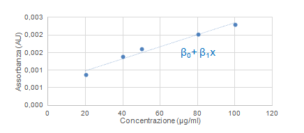
```

La retta tratteggiata è la retta di taratura i cui parametri vogliamo stimare a partire dal campione delle 5 misure sperimentali date.

Ragionando in maniera simile a quanto fatto nel capitolo *Statistica inferenziale* per la media, possiamo supporre che la misura sperimentale $y$ per un livello di concentrazione $x$ fissato differisca dal risultato terorico "vero" $\beta_0+\beta_1x$ per un errore sperimentale $\epsilon$ puramente casuale
$$
y=\beta_0+\beta_1x + \epsilon
$$
e che l'errore sperimentale $\epsilon$ sia distribuito come una normale di media 0 e varianza $\sigma^2$
$$
\epsilon \sim N(0,\sigma^2)
$$
Si noti che la varianza $\sigma^2$ è ipotizzata sempre uguale per tutte le misure (ipotesi di omoschedasticità).  
N.B. Ciò significa, sul piano pratico, che le 5 misure dei valori di y abbiano uguale precisione (in senso strettamente analitico, la precisione si rappresenta con il coefficiente di variazione che è la deviazione standard relativa%).

Altra importante ipotesi è che le misure siano indipendenti le une dalle altre, ossia che il risultato di ogni misura (ad es. $y_1$)
non è influenzato in alcun modo da una misura precedente o successiva (ad es. $y_2$).

## Stima dei parametri $\beta_0$ e $\beta_1$

Data una retta qualsiasi del piano $y=b_0+b_1x$, indichiamo con $e_i$ la differenza tra i 5 valori misurati $y_i$ e i 5 valori $b_0+b_1x_i$
$$
e_i=y_i-(b_0+b_1x_i)
$$

indicate con le frecce rosse in figura

```{r echo=FALSE,out.width="50%",fig.align='center'}
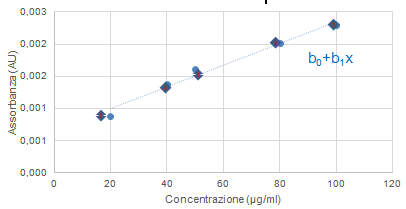
```

Si può dimostrare, (v. **metodo dei minimi quadrati** nel Glossario), che esiste una unica retta $y=\hat{\beta_0}+\hat{\beta_1}x$ che minimizza la somma dei quadrati $\sum_{i=1}^m e_i^2$ ($m=5$ nel nostro esempio) e che i valori $\hat{\beta_0}$ e $\hat{\beta_1}$ sono dati da
\begin{eqnarray*}
\hat{\beta_1}&=&\frac{\sum_{i=1}^m (x_i-\bar{x})(y_i-\bar{y})}{\sum_{i=1}^m(x_i-\bar{x})^2} \\
\hat{\beta_0}&=&\bar{y}-\hat{\beta}_1\bar{x}.
\end{eqnarray*}

I valori $\hat{\beta_0}$ e $\hat{\beta_1}$ dipendono dal campione di 5 misure, un nuovo campione porta a valori diversi. Sono variabili aleatorie.

Si verifica facilmente che $\hat{\beta_0}$ e $\hat{\beta_1}$  sono una stima puntuale dei parametri $\beta_0$ e $\beta_1$, cioè ripetendo un gran numero di esperimenti “in media” $\hat{\beta_0}$ e $\hat{\beta_1}$  tendono a coincidere con il valore «vero» $\beta_0$ e $\beta_1$.  
N.B. Questo concetto, si rappresenta formalmente con la media, o speranza matematica di una variabile casuale (ad es. $\beta_0$), e si indica con

$$
\mathbb{E}(\hat{\beta_0})=\beta_0 \quad \rm{e} \quad \mathbb{E}(\hat{\beta_1})=\beta_1
$$
in cui la notazione
$$
\mathbb{E}()
$$
deriva da *expected* o *expectation* in inglese o dal francese *espérance*, e formalizza il concetto di valore medio di un fenomeno aleatorio.


E' nota anche la precisione di questi stimatori, infatti si può dimostrare che 

\begin{eqnarray*}
\rm{Var}(\hat{\beta_0})&=&[\frac{1}{m}+\frac{\bar{x}^2}{\sum_{i=1}^m(x_i-\bar{x})^2}]\sigma^2\\
\rm{Var}(\hat{\beta_1})&=&\frac{\sigma^2}{\sum_{i=1}^m(x_i-\bar{x})^2} .
\end{eqnarray*}

Si noti che le varianze degli stimatori non dipendono dai risultati sperimentali $y_i$, sono anche chiamate «errore standard» degli stimatori (Excel). Sono determinate a priori – vale a dire che dipendono solo dal piano sperimentale.
Inoltre si noti che sono inversamente proporzionali a $\sum_{i=1}^m(x_i-\bar{x})^2$, cioè alla misura della “dispersione” delle $x$.                           

Le stime puntuali, una volta caricato il dataset, si ottengono nel menù Regressione lineare/semplice 

```{r echo=FALSE,out.width="50%",fig.align='center'}
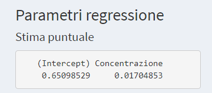
```

## Significatività dei coefficienti

Per fare inferenza a partire dalle 5 misure campionarie, abbiamo bisogno di conoscere la distribuzione di probabilità degli stimatori $\hat{\beta_0}$ e $\hat{\beta_1}$. Abbiamo innanzitutto bisogno di stimare la varianza $\sigma^2$. Una stima puntuale è data da:
$$
s^2=\frac{\sum_{i=1}^m[y_i-(\hat{\beta_0} + \hat{\beta_1}x_1)]^2}{m-2}
$$
Si può dimostrare che 

\begin{eqnarray*}
\frac{\hat{\beta_0}-\beta_0}{s\sqrt{h}}&\sim&t(m-2)\\
\frac{\hat{\beta_1}-\beta_1}{s\sqrt{1/S^2_{x}}}&\sim&t(m-2),
\end{eqnarray*}
dove $h=\frac{1}{m}+\frac{\bar{x}^2}{S^2_{x}}$ e $S^2_{x}=\sum_{i=1}^m(x_i-\bar{x})^2$.


Ragionando come fatto nel capitolo precedente per la media possiamo verificare la significatività dei coefficienti al $1-\alpha\%$ ($\alpha=0.05$ in generale):

* test ipotesi (*t-test*)

\begin{eqnarray*}
H_0: \beta_0=0 \quad & \rm{vs} & \quad H_0: \beta_0\neq0 \\
H_0: \beta_1=0 \quad & \rm{vs} & \quad H_1: \beta_0\neq0
\end{eqnarray*}

* intervallo di confidenza
\begin{eqnarray*}
% \nonumber to remove numbering (before each equation)
\hat\beta_0 & \pm & t(\alpha/2,m-2)s\sqrt{h} \\
\hat\beta_1 & \pm & t(\alpha/2,m-2)s\sqrt{1/S^2_{x}}
\end{eqnarray*}

Sempre dal menù Regressione lineare/semplice otteniamo gli estremi degli intervalli di confidenza al 95%

```{r echo=FALSE,out.width="50%",fig.align='center'}
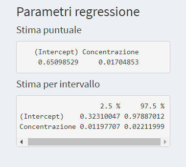
```

Se l'intervallo di confidenza contiene lo 0 non possiamo affermare che il parametro è significativamente diverso da 0, nel caso contrario possiamo affermare che il parametro è significativo. Nell'esempio considerato, sia l'intercetta che la pendenza sono significativamente diversi da 0.

Nella stessa pagina abbiamo anche il seguente output

```{r echo=FALSE,out.width="50%",fig.align='center'}
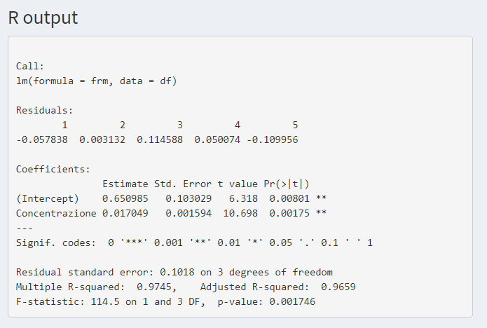
```
in cui sono riportati oltre al valore dei residui $y_i-(\hat{\beta_0}+\hat{\beta_1}x_i)$, la stima dei parametri $\hat{\beta_0}$ e $\hat{\beta_1}$, il loro errore standard $s\sqrt{h}$ e $s\sqrt{1/S^2_{x}}$ rispettivamente, le statistiche $t$ 
$$
\frac{\hat{\beta_0}}{s\sqrt{h}}, \qquad \qquad \frac{\hat{\beta_1}}{s\sqrt{1/S^2_{x}}}
$$

e il *p-value* dei *t-test* (vedi il capitolo precedente per la definizione).

Nell'output nella figura precedente viene riportata la stima di $\sigma$ *Residual standard error* con i relativi gradi di libertà. E' riportato anche il valore di $R^2$, un indicatore che misura quanto la variazione di $y$ è descritta dalla variazione di $x$ attraverso la relazione funzionale studiata, ($R^2$ è un indice di *fitting*, adattamento).

## Previsione del modello

In questo paragrafo ci occupiamo della stima dell'assorbanza "vera" $y_0=\beta_0+\beta_1x_0$ per un valore di concentrazione $x_0$.

```{r echo=FALSE,out.width="50%",fig.align='center'}
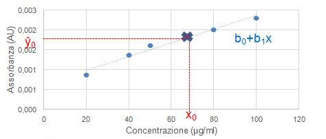
```

La stima puntuale della previsione è data da:
$$
\hat{y_0}=\hat{\beta_0}+\hat{\beta_1}x_0
$$
Il valore di tale stima dipende ovviamente dal campione di 5 misure; un nuovo campione porta ad un valore diverso della stima ma questa, "in media", ripetendo un gran numero di esperimenti, tende al valore "vero" $y_0=\beta_0+\beta_1x_0$.

$$
\mathbb{E}(\hat{y_0})=y_0
$$

Si osservi che il "valore vero" non è il valore di una misura in $x_0$ che è affetta da errore, ma la "media" di un gran numero di misure in $x_0$.

E' nota la precisione dello stimatore $\hat{y_0}$:
$$
\rm{Var}(\hat{y_0})=[\frac{1}{m}+\frac{(x_0-\bar{x})^2}{S^2_{x}}]\sigma^2
$$
Il valore $h_0=\frac{1}{m}+\frac{(x_0-\bar{x})^2}{S^2_{x}}$ è chiamato valore leva (*leverage*) per il punto $x_0$ ed è un indicatore della qualità dello stimatore $\hat{y_0}$.
L'unico parametro controllabile da cui dipende la precisione della previsione è $S^2_{x}$. Più grande è tale valore migliori sono le stime. 
Poiché $S^2_{x}$ misura lo "spread" delle $x$, è una buona idea quando si progetta un esperimento allargare il range delle $x$ il più possibile. Inoltre aumentando i valori delle $x$ verso gli estremi del range, si aumenta ulteriormente $S^2_{x}$.

In figura è indicato con la linea rossa il leverage per ogni valore di concentrazione nel range del nostro esempio, mentre è indicato con una linea verde il leverage con un "disegno sperimentale" leggermente modificato aumentando lo "spread" delle $x$ (i 5 campioni sono per le seguenti concentrazioni: 100, 100, 50, 20, 20) 

```{r echo=FALSE,out.width="50%",fig.align='center'}
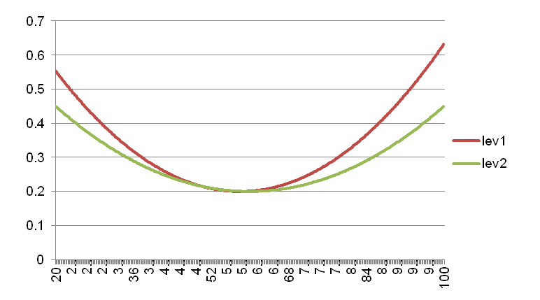
```

Si noti inoltre che a differenza dei modelli per la media visti nel capitolo precedente in cui il valore "leva" dipendeva dal numero di osservazioni nel punto, per la regressione lineare dipende anche dalla "posizione" del punto rispetto alla media.

Altra importante osservazione da fare è che il leverage non dipende dai risultati sperimentali ma dipende soltanto da come sono stati progettati gli esperimenti.

Si può dimostrare che
$$
\frac{\hat{y_0}-y_0}{s\sqrt{\frac{1}{m}+\frac{(x_0-\bar{x})^2}{S^2_{x}}}}\sim t(m-2).
$$

Ragionando come in precedenza possiamo quindi definire il seguente *intervallo di confidenza* (stima per intervallo della previsione)
$$
\hat{y_0}\pm t(\alpha/2,m-2)s\sqrt{\frac{1}{m}+\frac{(x_0-\bar{x})^2}{S_{xx}}}
$$

Nella seguente figura (ottenuta in Regressione lineare/semplice) è rappresentato l'intervallo di confidenza (zona grigia) per i valori di concentrazione nel range del nostro esempio.

```{r echo=FALSE,out.width="50%",fig.align='center'}
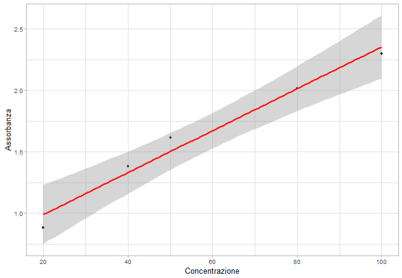
```

Si noti che, per quanto osservato in precedenza sul leverage, l'intervallo è "più stretto" nella parte centrale del range e quindi la "qualità" della previsione è migliore in quella regione del range.

In Regressione lineare/semplice, fissato il valore $x_0$ della concentrazione viene fornito l'intervallo di confidenza (al 95%) della previsone dell'assorbanza

```{r echo=FALSE,out.width="50%",fig.align='center'}
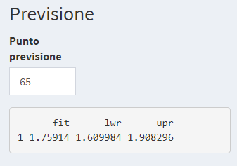
```

## Verifica delle ipotesi

Affinché quanto detto sia valido, in particolare per quanto riguarda l'inferenza sui parametri e sulla stima, dobbiamo verificare che siano soddisfatte le ipotesi formulate all'inizio di questo capitolo: tali ipotesi erano che i residui sulle y fossero distribuiti secondo la normale (di media 0), che avessero varianze non troppo differenti tra loro (omoschedasticità) e che fossero indipendenti tra loro.

Nel menù Regressione lineare/semplice alla pagina *Verifica ipotesi* sono proposti i seguenti test e grafici:

* **Media nulla**   
sono proposti un *t-test* in cui l'ipotesi nulla è che la media dei residui sia 0 (la media non è significativamente diversa da 0 per valori del *p-value* più grandi di $\alpha$ = 0.05) e un grafico dei residui vs i valori predetti (in cui i residui devono essere distribuiti casualmente intorno alla retta orizzontale tratteggiata per convalidare l'ipotesi di indipendenza). Da questo grafico si possono osservare eventuali deviazioni dalla linearità del modello. Se la nuvola dei punti plottati assume qualche particolare forma, ad esempio di parabola, si ha la prova della esistenza di deviazione dalla linearità.

```{r echo=FALSE,out.width="50%",fig.align='center'}
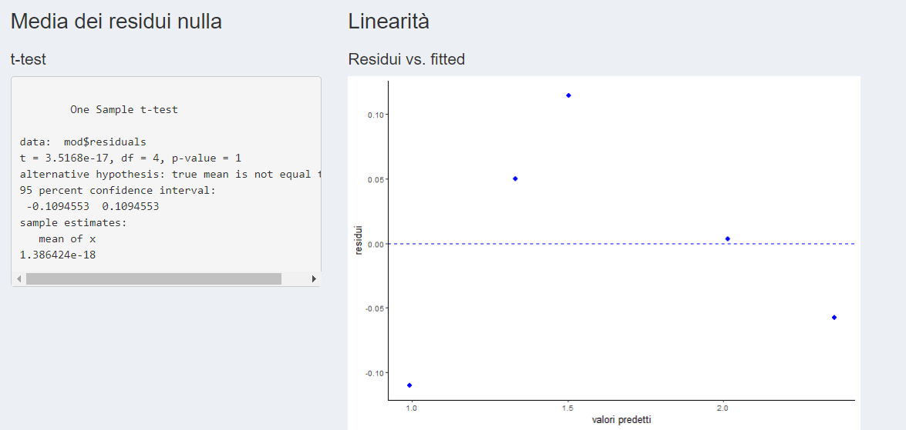
```


* **Normalità**  
Viene proposto il *test di Shapiro Wilk*, uno dei test più potenti per la normalità soprattutto per piccoli campioni: l'ipotesi nulla è che la distribuzione sia normale. La normalità è verificata per valori grandi del *p-value* ($> \alpha = 0.05$). Si calcola la statistica *W* ($0<W<1$), data dal rapporto di due stimatori alternativi di $\sigma^2$. Se la distribuzione è normale la statistica W risulta prossima a 1.   Viene anche proposto il *QQ-Plot* in cui sono rappresentati i quantili del campione vs i quantili teorici di una distribuzione normale. Se la distribuzione dei dati del campione è normale i quantili campionari sono avviluppati intorno alla retta tratteggiata.

```{r echo=FALSE,out.width="50%",fig.align='center'}
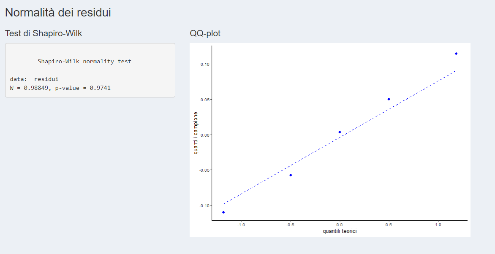
```

* **Omoschedasticità**  
Viene proposto il *test di Breusch Pagan* la cui ipotesi nulla è l'omoschedasticità dei residui. La omoschedasticità è verificata per valori grandi del *p-value* ($>\alpha = 0.05$)). E' anche proposto un grafico della radice dei residui vs i valori predetti.
In caso di eteroschedasticità nel grafico risulta evidente una tendenza di dispersione, ad esempio crescente, con la nuvola dei punti che assume una forma a cono, cosa che non accade in caso di omoschedasticità degli errori.

```{r echo=FALSE,out.width="50%",fig.align='center'}
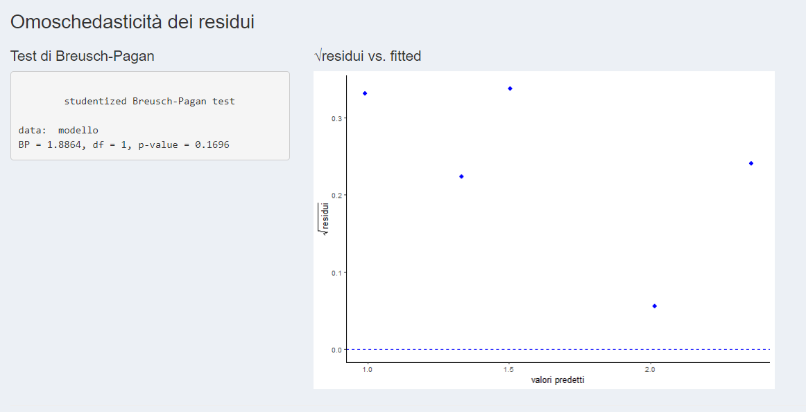
```

* **Correlazione seriale**  
Viene proposto il *test di Durbin-Watson* per valutare la presenza di autocorrelazione tra i dati. L'ipotesi nulla è la assenza di autocorrelazione dei residui. La assenza di autocorrelazione è verificata per valori grandi del *p-value* ($> \alpha = 0.05$). Il grafico che è stampato insieme alla statistica del test mostra il residuo n-esimo vs il residuo (n-1)-esimo e serve a mettere in evidenza la eventuale correlazione seriale degli errori.

```{r echo=FALSE,out.width="50%",fig.align='center'}
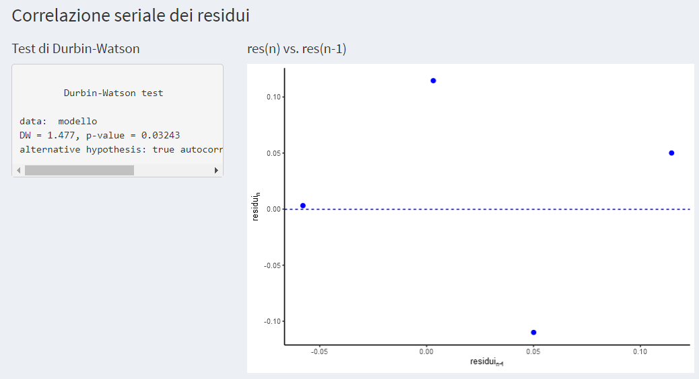
```


