# Analisi della Varianza
```{r include=FALSE}
load("Dati/Anova.RData")
```
## Analisi della varianza a un fattore
Consideriamo il dataset *Collirio* 

```{r echo=FALSE}
X=cbind(Collirio[Collirio$Preparazione=="Nessuna",2],Collirio[Collirio$Preparazione=="A.R",2],
        Collirio[Collirio$Preparazione=="A5s",2],Collirio[Collirio$Preparazione=="A10s",2])
colnames(X)=c("Nessuna","A.R","A5s","A10s")
row.names(X)=c(1:8)
X
```
che consiste in 32 misure sperimentali (*Pesata*) della massa di una goccia di un collirio preparato prima dell’uso in 4
modi diversi, indicati nelle colonne della tabella; questa ultima variabile (*Preparazione*) è un *fattore* qualitativo studiato a 4 livelli: Nessuna, A.R., A5s, A10s.

Possiamo modellizzare le 8 misure per ogni tipo di *Preparazione* come
$$
y_{i1}=\mu+\alpha_1+\epsilon_{i1} \qquad y_{i2}=\mu+\alpha_2+\epsilon_{i2} \qquad y_{i3}=\mu+\alpha_3+\epsilon_{i3} \qquad y_{i4}=\mu+\alpha_4+\epsilon_{i4}
$$
dove $\mu+\alpha_i$ è la media "vera" della *Pesata* con $\mu$ parametro comune a tutti gli effetti, detta media complessiva, e  $\alpha_1, \alpha_2, \alpha_3$ e $\alpha_4$ sono i contributi nella media "vera" dovuti all'effetto della *Preparazione*: Nessuna, A.R., A5s, A10s. Inoltre gli errori casuali
$$
\epsilon_{i1}\sim N(0,\sigma^2) \qquad \epsilon_{i2}\sim N(0,\sigma^2) \qquad \epsilon_{i3}\sim N(0,\sigma^2) \qquad \epsilon_{i4}\sim N(0,\sigma^2)
$$
sono a due a due non correlati tra loro. Si noti che è richiesto che abbiano tutti la stessa varianza $\sigma^2$ (ipotesi di omoschedasticità).

Cominciamo con l'importare in Dati/Esempi Master il dataset *Collirio*. In "Variabili" nella pagina "Variabili qualitative" bisogna selezionare la variabile *Preparazione* (fattore qualitativo a 4 livelli)

```{r echo=FALSE,out.width="50%",fig.align='center'}
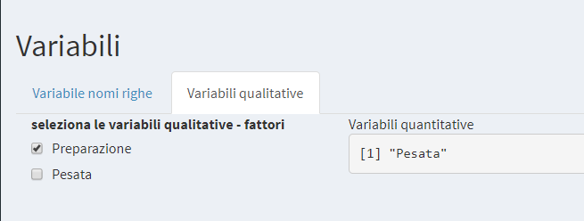
```

Esaminiamo l’effetto del fattore *Preparazione* sulla *Pesata*. Per avere una prima idea grafica possiamo, in "Statistica descrittiva/Box plot", ottenere i box plot delle quattro colonne di dati.    

```{r echo=FALSE,out.width="50%",fig.align='center'}
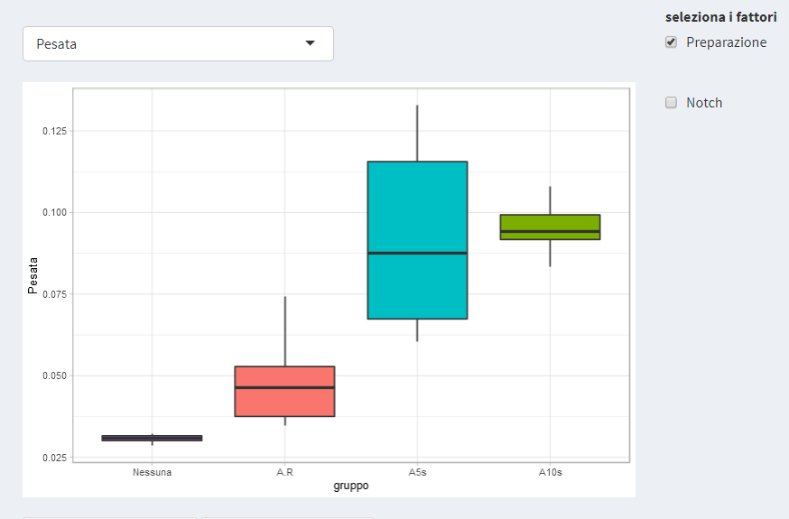
```

Vogliamo testare se 
$$
\alpha_1=\alpha_2=\alpha_3=\alpha_4=0
$$
i.e. se la *Preparazione* è ininfluente sulla *Pesata* oppure se per almeno un $i$ 
$$
\alpha_i \neq \ 0
$$
Vogliamo verificare se esiste un effetto statisticamente significativo del fattore *Preparazione* sui dati di *Pesata* oppure se le variazioni numeriche che si osservano sono dovute al caso.

Introduciamo la *media della variazione tra gruppi*,calcolata come somma degli scarti di ogni media di gruppo dalla media generale, moltiplicati per il numero di dati di ciascun gruppo, e divisa per i gradi di libertà:
$$
MS_{tra}=\frac{\sum_{j=1}^nm_j(\bar{y_j}-\bar{y})^2}{n-1}
$$
Nel nostro esempio numerico $n=4$ (numero di livelli del fattore *Preparazione*), $m_j=8$ (numerosità di ogni gruppo) per ogni $j= 1, 2, 3, 4$ e $\bar{y_j}$ media campionaria di ogni gruppo. Nel menù "Statistica descrittiva/ Summary" si ottengono gli indicatori di posizione, di dispersione e la numerosità campionaria per ogni singolo gruppo

```{r echo=FALSE,out.width="50%",fig.align='center'}
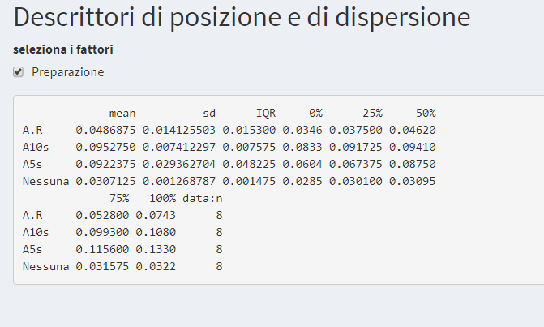
```

Si può provare che:

* in assenza di vero effetto gruppo (i.e. della *Preparazione*) $MS_{tra}$ è uno stimatore della varianza comune $\sigma^2$
* in presenza di vero effetto gruppo (i.e. l'effetto della *Preparazione* è significativo) $MS_{tra}$ tende ad essere maggiore di $\sigma^2$

Confrontiamo $MS_{tra}$ con la *varianza combinata*
$$
MS_{in}=s_c^2=\frac{(m_1-1)s_1^2+\cdots+(m_n-1)s_n^2}{m-n}
$$
dove $m$ indica la numerosità del campione (nel nostro esempio $m=32$) e $s_j^2$ la deviazione standard campionaria del gruppo $j$.
Si noti che non è altro che la generalizzazione al caso di $n$ gruppi della *varianza combinata* già definita nel caso $n=2$ nel capitolo della Statistica inferenziale. $MS_{in}$ è uno stimatore della varianza comune $\sigma^2$. 

Sotto l'ipotesi nulla 
$$
\alpha_1=\alpha_2=\alpha_3=\alpha_4=0
$$
si può dimostrare che 

$$
\frac{MS_{tra}}{MS_{in}} \sim F(n-1,m-n)
$$
dove $F$ è la distribuzione di Fisher già introdotta nel capitolo della Statistica inferenziale (*F-test*).

E' possibile quindi eseguire il test d'ipotesi (ad una coda, poichè, come abbiamo detto, il rapporto considerato tende ad essere maggiore o uguale a 1)
$$
\rm{H_0:\ } \alpha_1=\alpha_2=\alpha_3=\alpha_4=0 \qquad \rm{vs} \qquad \rm{H_1:\ } \alpha_i\neq0 \quad \rm{per \ almeno\  un\ } i
$$
Rigettiamo l'ipotesi nulla se il risultato $\frac{MS_{tra}}{MS_{in}}$ ottenuto dal nostro campione è maggiore del $(1-\alpha)$-esimo quantile ($\alpha$ livello di significatività, in generale $\alpha=0.05$) della distribuzione $F(n-1,m-n)$ (zona blu a destra, che essendo il test ad una coda rapprenta il 5% delle possibilità esistenti).
Per eseguire il test ANOVA del nostro esempio, una volta caricati i dati, in Statistica Inferenziale /Anova si ottiene
```{r echo=FALSE,out.width="50%",fig.align='center'}
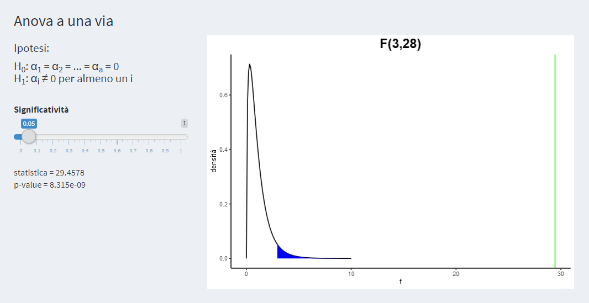
```

in cui viene fornito il valore della statistica $\frac{MS_{tra}}{MS_{in}}$ e il *p-value*. Il ragionamento è il consueto: rifiutiamo l'ipotesi nulla e quindi il fattore *Preparazione* è significativo se il *p-value* è minore di 0.05 o equivalentemente se nel grafico la linea verde (che rapprenta il valore della statistica) è nella zona blu.

Viene fornito anche il seguente output

```{r echo=FALSE,out.width="50%",fig.align='center'}
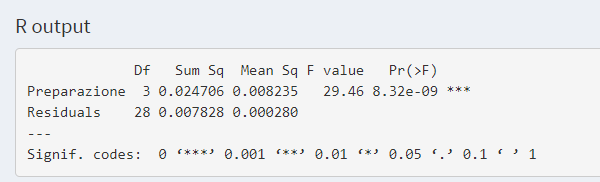
```
in cui sono indicate le somme quadratiche e le relative medie *tra* e *nei* gruppi, il rapporto delle medie (ossia la statistica $\frac{MS_{tra}}{MS_{in}}$) e il $p-value$.


Per poter considerare vere le conclusioni fin qui raggiunte bisogna verificare le ipotesi da cui siamo partiti:

* **Normalità**  
Per quanto riguarda la normalità dei residui viene fornito il test di *Shapiro-Wilk* e il *qq-plot*, già discussi nei capitoli precedenti

```{r echo=FALSE,out.width="60%",fig.align='center'}
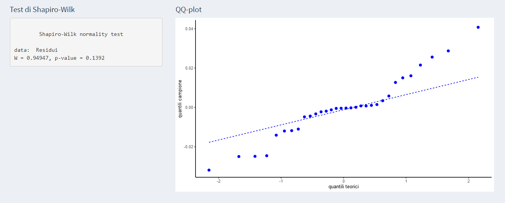
```

* **Omoschedasticità**  
Per quanto riguarda l'omoschedasticità vengono forniti i seguenti test:

  + *test di Bartlett* - poco robusto (sensibile alla violazione della ipotesi di normalità)
  ```{r echo=FALSE,out.width="50%",fig.align='center'}
  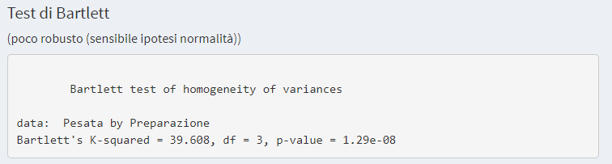
  ```

  + *test di Fligner-Killeen* - più robusto del test di Bartlett

  ```{r echo=FALSE,out.width="50%",fig.align='center'}
  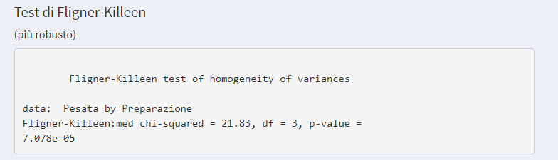
  ```
  + *test di Levene* - da usare se si hanno numerosità campionarie diverse  

  ```{r echo=FALSE,out.width="50%",fig.align='center'}
  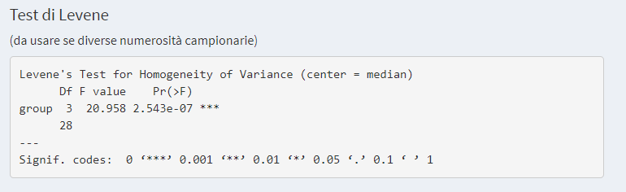
  ```
  + *test di Breusch-Pagan* - adatto a campioni con numerosità grande
  ```{r echo=FALSE,out.width="50%",fig.align='center'}
  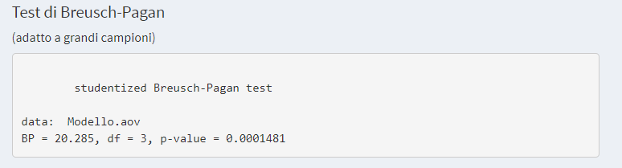
  ```
  + *test di Cochran* - test della varianza massima (minima)

  ```{r echo=FALSE,out.width="50%",fig.align='center'}
  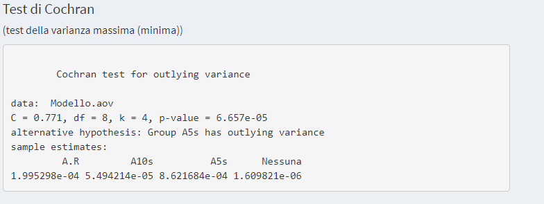
  ```

Si osservi che nel nostro esempio tutti i test (vedi figure sopra) evidenziano che non è verificata l’ipotesi di omoschedasticità (*p-value*<<0.05).
Il test Anova non è quindi applicabile.
In casi come questo diventa necessario rivedere e verificare che non siano presenti valori anomali nei dati (si veda dataset *Collirio_1waov*) oppure, se tutti i dati sono "buoni" e si dimostra che la distribuzione degli stessi non è normale (oppure non si può raggiungere alcuna conclusione al riguardo perché ad esempio si hanno pochi dati) si impiega un test non parametrico quale ad es. il test di Kruskal-Wallis che è appunto l'equivalente non parametrico della ANOVA.

## Analisi della varianza a due fattori

Consideriamo il dataset di 32 misure sperimentali della *Pesata* di un collirio (sono le stesse misure del dataset *Collirio_1waov*) in cui distinguiamo  due fattori qualitativi *Preparazione* [del campione] e *Lotto*, numero di lotto di produzione del collirio.  
Il primo fattore ha 4 livelli (Nessuna, A.R, A5s e A10s), il secondo 2 (2150, 2151).

Oltre alla modalità di *Preparazione* si vuole verificare ora se la pesata di ogni goccia di collirio dipende anche 
dal fattore *Lotto*  di produzione

Possiamo rappresentare i dati in 4 colonne (una per ogni livello del fattore *Preparazione*) e
2 gruppi di righe (una per ogni livello del fattore *Lotto*). Ci sono 4 ripetizioni in ognuna delle 8 celle
*Preparazione x Lotto*

```{r echo=FALSE}
X=cbind(Collirio_2waov[1:8,3],Collirio_2waov[9:16,3],Collirio_2waov[17:24,3],Collirio_2waov[25:32,3])
colnames(X)=c("Nessuna","A.R","A5s","A10s")
row.names(X)=c("2150","","","","2151","","","")
X
```

Possiamo modellizzare le 4 misure per ognuna delle 8 combinazioni *Preparazione x Lotto*

$$
y_{ijk}=\mu+\alpha_{i}+\beta_{j}+(\alpha \beta)_{ij}+\epsilon_{ijk}
$$
dove $\mu+\alpha_{i}+\beta_{j}+(\alpha \beta)_{ij}$ sono le medie "vere" della *Pesata*, $\alpha_i$ e $\beta_j$ sono gli effetti sulla *Pesata* media dovuti rispettivamente dai fattori *Preparazione* e *Lotto*, e $(\alpha \beta)_{ij}$ gli effetti sulla *Pesata* media non attribuibili all'effetto lineare di $\alpha_i$ e $\beta_j$ presi da soli; questo effetto combinato di $\alpha_i$ e $\beta_j$ è un effetto cosiddetto di *interazione* dei due fattori.
Come nei casi precedenti formuliamo l'ipotesi che gli errori siano
$$
\epsilon_{ijk} \sim N(0,1)
$$
e indipendenti tra loro.

Vogliamo testare la significatività statistica dell'effetto *Preparazione*
$$
\rm{H_{0,1}:\ } \alpha_{1}=\alpha_{2}=\alpha_{3}=\alpha_{4}=0 \qquad \rm{vs} \qquad \rm{H_{1,1}:\ } \alpha_{i}\neq 0 \quad \rm{per \ almeno \ un} \ i
$$
dell'effetto *Lotto*
$$
\rm{H_{0,2}:\ } \beta_{1}=\beta_{2}=0 \qquad \rm{vs} \qquad \rm{H_{1,2}:\ } \beta_{j}\neq 0 \quad \rm{per \ almeno \ un} \ j
$$

e dell'effetto interazione *Preparazione x Lotto*
$$
\rm{H_{0,12}:\ } (\alpha \beta)_{ij}=0 \qquad \rm{vs} \qquad \rm{H_{1,2}:\ } (\alpha \beta)_{ij}\neq 0 \quad \rm{per \ almeno \ un} \ ij
$$

Consideriamo:  

la *media della variazione del 1° fattore (Preparazione)*
$$
MS_{F_1}=\frac{bm\sum_{i=1}^a(\bar{y}_{*i} -\bar{y})^2}{a-1}
$$
dove $\bar{y}_{*i}$ è la media campionaria per ognuno degli $a$ livelli del fattore *Preparazione* (nel nostro esempio $a=4$, quindi si calcola la media di ciascuna delle 4 colonne del dataset), mentre $\bar{y}$ è la media campionaria di tutte le $abm$ misure (dove $b=2$ sono i livelli del fattore *Lotto*, $m=4$ è la numerosità campionaria delle 8 combinazioni *Preparazione x Lotto*, e $abm= 4·2·4=32$ è il numero complessivo delle misure).   

La *media della variazione del 2° fattore (Lotto)* si calcola come segue:
$$
MS_{F_2}=\frac{am\sum_{j=1}^b(\bar{y}_{j*} -\bar{y})^2}{b-1}
$$
dove $\bar{y}_{j*}$ è la media campionaria per ognuno dei $b=2$ livelli del fattore *Lotto*.    

La *media della variazione dell'interazione* è data da
$$
MS_{{int}}=\frac{m\sum_{i=1}^a\sum_{j=1}^b(\bar{y}_{ij}-\bar{y}_{i*}-\bar{y}_{*j} -\bar{y})^2}{(a-1)(b-1)}
$$

e la *media dei residui*
$$
MS_{{res}}=\frac{\sum_{i=1}^a\sum_{j=1}^b\sum_{k=1}^m(y_{ijk}-\bar{y}_{ij})^2}{ab(m-1)}
$$

Si può dimostrare che sotto l'ipotesi nulla $\rm{H_{0,1}}$, $\rm{H_{0,2}}$ e $\rm{H_{0,2}}$ dei 3 test precedentemente descritti che

\begin{eqnarray*}
\frac{MS_{F_1}}{MS_{{res}}}&\sim&F(a-1,ab(m-1))\\
\frac{MS_{F_2}}{MS_{{res}}}&\sim&F(b-1,ab(m-1))\\
\frac{MS_{{int}}}{MS_{{res}}}&\sim&F((a-1)(b-1),ab(m-1))
\end{eqnarray*}

Per ogni test si può procedere come abbiamo visto nel paragrafo precedente.  
Si ricorda che è importante verificare la sussistenza delle ipotesi di costruzione della ANOVA (errori distribuiti come la normale, omoschedastici e indipendenti tra loro) per potere sostenere la validità del risulato dei test.

Vediamo come eseguire l'analisi della varianza per il dataset *Collirio_2waov*. Una volta caricato il dataset isogna indicare al software in "Dati/Variabili" quali sono i fattori qualitativi. Nel nostro caso *Preparazione* e *Lotto*

  ```{r echo=FALSE,out.width="50%",fig.align='center'}
  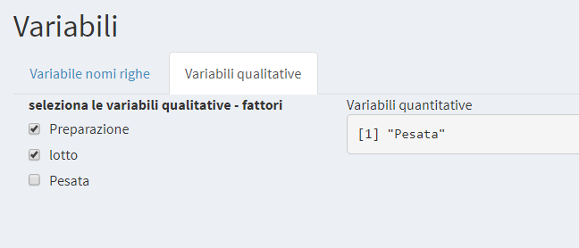
  ```
Quindi in "Statistica inferenziale/Anova" nella pagina "Anova:due fattori" sono forniti i 3 test e il consueto output

  ```{r echo=FALSE,out.width="50%"}
  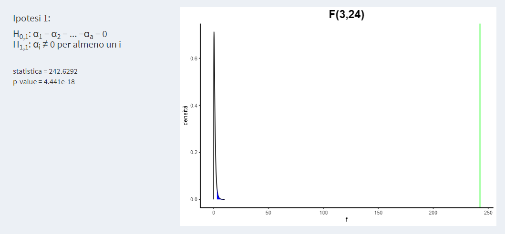
    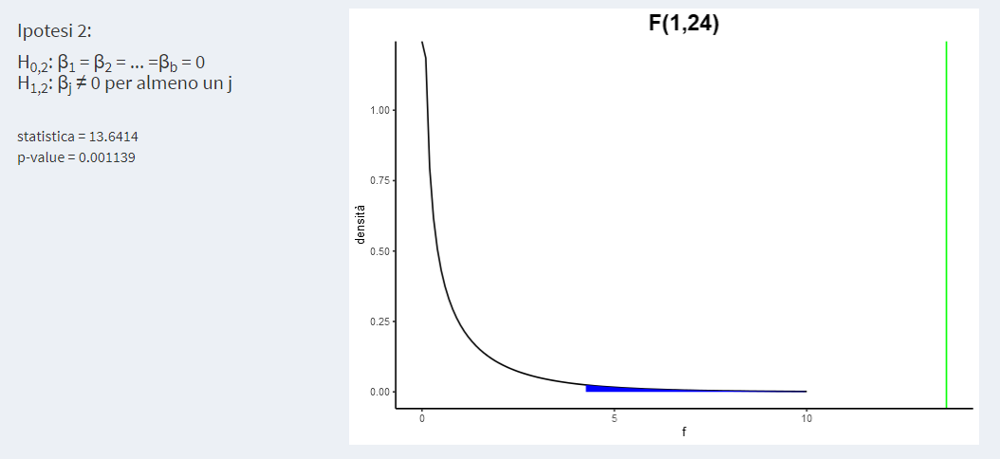
  ```
  ```{r echo=FALSE,out.width="50%"}
  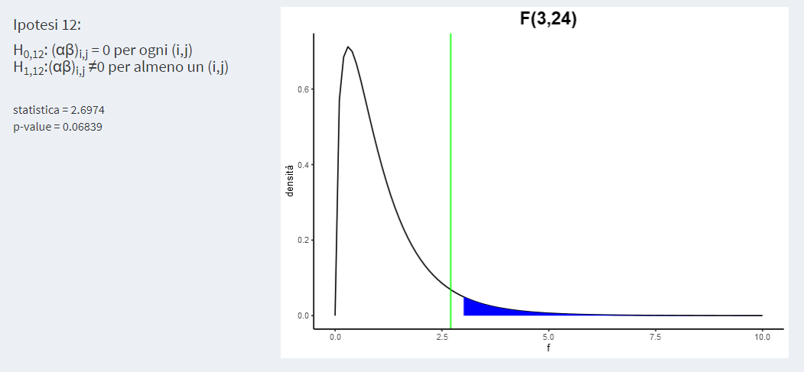
  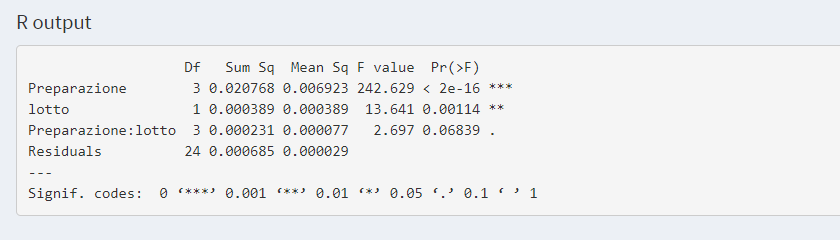
  ```
 in cui sono indicate le *medie* $MS_{F_1}, MS_{F_2}, MS_{F_{int}}$ e $MS_{F_{res}}$ sopra definite, le relative statistiche e il valore del *p-value*.
  
Vengono forniti anche i grafici di interazione. Quando le linee dei grafici di interazione non sono parallele si può sospettare l'esistenza di una interazione tra i fattori interessati.

  ```{r echo=FALSE,out.width="50%",fig.align='center'}
  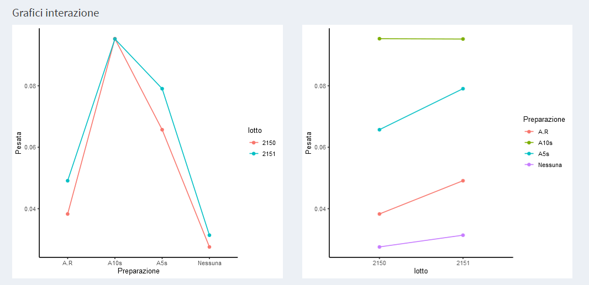
  ```
Per quanto riguarda la verifica delle ipotesi si prosegue con la stessa logica della Anova a un fattore nella pagina "Verifica ipotesi: 2-waov".


